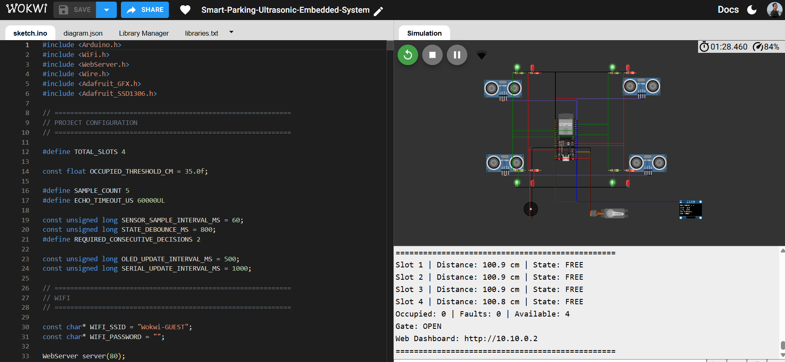
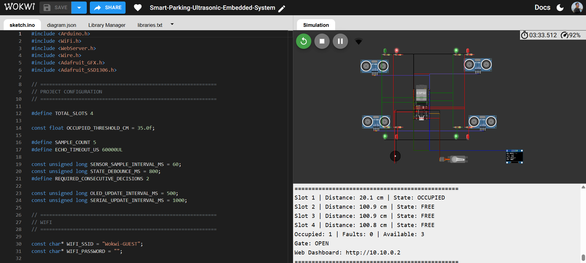
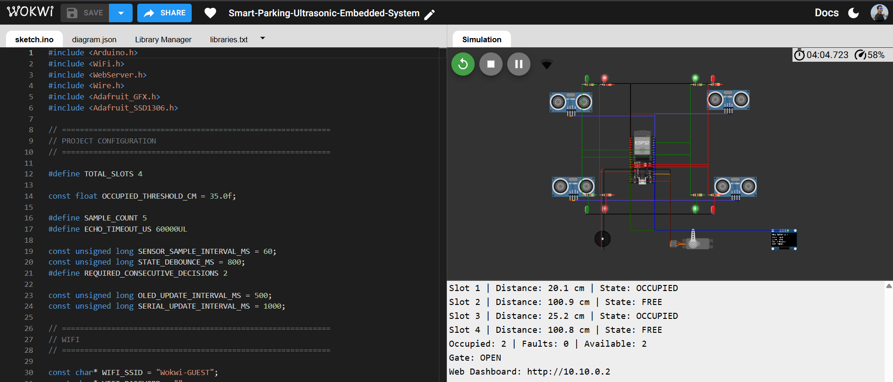
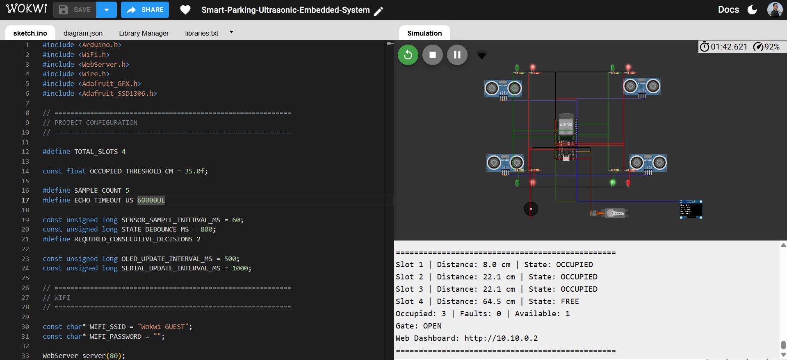
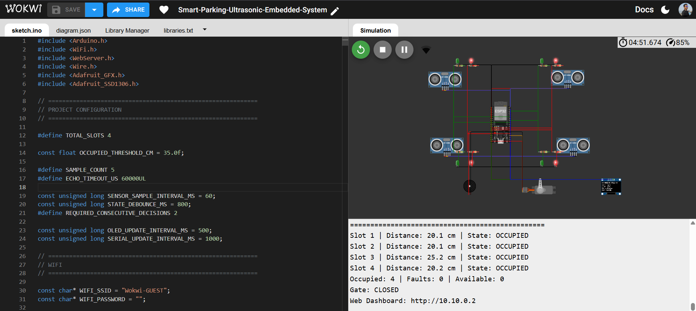

# 🚗 Smart Parking Ultrasonic Embedded System


<p align="center">

[▶️ **Run Live Wokwi Simulation**](https://wokwi.com/projects/472127403112620033)

</p>

> An ESP32-based IoT smart parking prototype that monitors four parking slots using ultrasonic sensors, provides local status indication, controls an entrance barrier based on parking availability, and provides Wi-Fi-based web monitoring.

---

## 📑 Table of Contents

1. [Project Overview](#-project-overview)
2. [Objectives](#-objectives)
3. [Key Features](#-key-features)
4. [System Architecture](#️-system-architecture)
5. [System Workflow](#-system-workflow)
6. [Parking Detection Logic](#-parking-detection-logic)
7. [Sensor Filtering](#-sensor-filtering)
8. [State Stabilization](#️-state-stabilization)
9. [LED Indication](#-led-indication)
10. [Gate Control](#-gate-control)
11. [Parking-Full Alert](#-parking-full-alert)
12. [OLED Display](#️-oled-display)
13. [Wi-Fi Web Dashboard](#-wi-fi-web-dashboard)
14. [Pin Configuration](#-pin-configuration)
15. [Firmware Parameters](#️-important-firmware-parameters)
16. [Fail-Safe Sensor Handling](#-fail-safe-sensor-handling)
17. [Parking-State Examples](#-parking-state-examples)
18. [Technology Stack](#️-technology-stack)
19. [How to Run](#️-how-to-run-the-project)
20. [Repository Structure](#-repository-structure)
21. [Testing and Validation](#-testing-and-validation)
22. [Screenshots](#-screenshots)
23. [Future Enhancements](#-future-enhancements)
24. [Skills Demonstrated](#-skills-demonstrated)
25. [Author](#-author)
26. [License](#-license)

---

## 📌 Project Overview

The **Smart Parking Ultrasonic Embedded System** is an ESP32-based IoT and embedded-system prototype designed to monitor parking-slot occupancy in real time.

The system uses **four ultrasonic sensors** to detect the distance of objects in individual parking slots. The ESP32 processes the sensor readings, determines whether each slot is **FREE** or **OCCUPIED**, and updates the OLED display, LED indicators, servo-controlled gate, buzzer, Serial Monitor, and Wi-Fi web dashboard.

The current prototype supports **four parking slots** and has been developed and validated using **Wokwi simulation**.

---

## 🎯 Objectives

- Detect vehicle presence in individual parking slots.
- Determine the FREE and OCCUPIED state of each slot.
- Reduce unstable state changes using sensor filtering and debounce logic.
- Display parking information locally using an OLED display.
- Provide visual slot-status indication using LEDs.
- Calculate available, occupied, and faulty slots.
- Control the entrance barrier using a servo motor.
- Provide an audible alert when no safe parking space is available.
- Provide remote parking-status monitoring through Wi-Fi.
- Demonstrate a complete ESP32-based IoT smart-parking architecture.

---

## ✨ Key Features

- ✅ Four parking-slot monitoring
- ✅ ESP32-based embedded controller
- ✅ Four ultrasonic distance sensors
- ✅ Real-time FREE/OCCUPIED detection
- ✅ 35 cm occupancy threshold
- ✅ Five-sample sensor filtering
- ✅ Highest and lowest sample removal
- ✅ Consecutive-decision state stabilization
- ✅ 800 ms state debounce
- ✅ Sensor-fault detection
- ✅ Green/Red LED status indication
- ✅ OLED parking-status display
- ✅ Automatic available/occupied/fault counting
- ✅ Servo-controlled entrance gate
- ✅ Parking-full buzzer alert
- ✅ Wi-Fi connectivity
- ✅ HTTP web dashboard
- ✅ Automatic dashboard refresh
- ✅ Serial Monitor status reporting
- ✅ Wokwi simulation and validation

---

## 🏗️ System Architecture

```text
                         ┌─────────────────────┐
                         │        ESP32        │
                         │   Main Controller   │
                         └──────────┬──────────┘
                                    │
              ┌─────────────────────┼─────────────────────┐
              │                     │                     │
              ▼                     ▼                     ▼
      ┌───────────────┐      ┌────────────┐      ┌──────────────┐
      │ 4 Ultrasonic  │      │    OLED    │      │     Wi-Fi    │
      │    Sensors    │      │  Display   │      │ Connectivity │
      └───────┬───────┘      └────────────┘      └──────┬───────┘
              │                                         │
              ▼                                         ▼
      ┌───────────────┐                         ┌────────────────┐
      │ Slot Occupancy│                         │ Web Dashboard  │
      │   Detection   │                         └────────────────┘
      └───────┬───────┘
              │
       ┌──────┼───────────────┐
       │      │               │
       ▼      ▼               ▼
     LEDs   Buzzer          Servo
       │      │               │
       └──────┴───────┬───────┘
                      ▼
              Parking Status
                      │
                      ▼
                Entrance Gate
```

---

## 🔄 System Workflow

```text
Ultrasonic Sensors
        ↓
Collect 5 Distance Samples
        ↓
Remove Highest Reading
        ↓
Remove Lowest Reading
        ↓
Average Remaining 3 Readings
        ↓
Validate Sensor Reading
        ↓
Apply 35 cm Occupancy Threshold
        ↓
Consecutive Decisions + 800 ms Debounce
        ↓
FREE / OCCUPIED / SENSOR FAULT
        ↓
┌───────────┬───────────┬───────────┬──────────────┐
│           │           │           │              │
▼           ▼           ▼           ▼              ▼
OLED       LEDs       Servo       Buzzer       Web Dashboard
```

---

## 📡 Parking Detection Logic

The system uses the following occupancy rule:

```text
Distance < 35 cm  →  OCCUPIED
Distance ≥ 35 cm  →  FREE
```

The threshold is defined in the firmware as:

```cpp
const float OCCUPIED_THRESHOLD_CM = 35.0f;
```

---

## 🧮 Sensor Filtering

Each sensor uses a **five-sample filtering method**.

The processing sequence is:

```text
5 readings → Remove highest → Remove lowest → Average remaining 3 → Filtered distance
```

This reduces the influence of unusually high or low sensor readings.

The firmware also performs sensor validation. If **two or more readings are invalid** within a five-sample group, the sensor is treated as faulty. A faulty sensor is not counted as an available parking slot.

---

## ⏱️ State Stabilization

A detected state change is not applied immediately. The firmware requires:

- At least **2 consecutive decisions**
- A minimum **800 ms debounce period**

before applying a new FREE/OCCUPIED state, reducing unstable transitions caused by temporary sensor fluctuations.

```text
New Sensor Decision → Candidate State → Consecutive Decision Check → 800 ms Stability Check → Apply New State
```

---

## 🚦 LED Indication

Each parking slot has a green and red LED.

| Condition | Green LED | Red LED |
|---|---:|---:|
| FREE | ON | OFF |
| OCCUPIED | OFF | ON |
| SENSOR FAULT | OFF | ON |

A sensor fault therefore uses a fail-safe red indication.

---

## 🚧 Gate Control

The current prototype uses **parking availability** to demonstrate automatic barrier control.

```text
Available slots > 0  →  GATE OPEN
Available slots = 0  →  GATE CLOSED
```

When parking becomes full, the servo moves the gate to the closed position.

### Important Design Note

This is an **availability-based gate-control prototype**. In a production parking system, a dedicated entrance/vehicle-detection sensor would normally be used to detect a vehicle approaching the gate. The current project uses parking availability to demonstrate the automatic barrier-control logic.

---

## 🔊 Parking-Full Alert

When no safe parking space is available:

```text
Available slots = 0 → Parking Full → Gate CLOSED → Buzzer Alert
```

The buzzer produces a periodic double-beep alert while the parking system remains full.

---

## 🖥️ OLED Display

The SSD1306 OLED provides local system information, including available slots, individual slot states, occupied/free/fault counts, and gate state.

The slot-state notation used internally is:

```text
F = FREE
O = OCCUPIED
X = SENSOR FAULT
```

---

## 🌐 Wi-Fi Web Dashboard

The ESP32 connects to Wi-Fi using:

```text
SSID: Wokwi-GUEST
Password: (empty)
```

After successful connection, the ESP32 starts an HTTP server on port `80`. The Serial Monitor displays the local dashboard address:

```text
Web Dashboard: http://<ESP32-IP-ADDRESS>
```

The browser dashboard shows available/occupied slots, sensor-fault count, individual slot distance and status, gate status, and parking-full indication. It automatically refreshes every **3 seconds**.

---

## 🔌 Pin Configuration

| Component | GPIO Pin(s) | Purpose |
|---|---:|---|
| Slot 1 Ultrasonic | TRIG 5, ECHO 17 | Distance sensing |
| Slot 2 Ultrasonic | TRIG 16, ECHO 4 | Distance sensing |
| Slot 3 Ultrasonic | TRIG 27, ECHO 26 | Distance sensing |
| Slot 4 Ultrasonic | TRIG 25, ECHO 33 | Distance sensing |
| Slot 1 LEDs | Green 18, Red 2 | Slot indication |
| Slot 2 LEDs | Green 19, Red 12 | Slot indication |
| Slot 3 LEDs | Green 21, Red 13 | Slot indication |
| Slot 4 LEDs | Green 22, Red 14 | Slot indication |
| OLED | SDA 32, SCL 23 | I2C display |
| Servo Motor | GPIO 15 | Gate control |
| Buzzer | GPIO 0 | Parking-full alert |

> ⚠️ **Hardware note:** GPIO 0 is a boot-strapping pin on the ESP32 — its state at power-on/reset affects whether the chip boots normally or enters flashing mode. This works fine in Wokwi simulation, but on real hardware, anything holding GPIO 0 LOW at reset (like a buzzer wired the wrong way) can prevent the board from booting. If porting this to physical hardware, consider moving the buzzer to a non-strapping GPIO.

---

## ⚙️ Important Firmware Parameters

| Parameter | Value |
|---|---:|
| Total Parking Slots | 4 |
| Occupied Threshold | 35 cm |
| Sensor Samples | 5 |
| Filtered Samples | 3 |
| Required Consecutive Decisions | 2 |
| State Debounce | 800 ms |
| OLED Update Interval | 500 ms |
| Serial Update Interval | 1000 ms |
| Web Dashboard Refresh | 3 seconds |
| Wi-Fi Retry Interval | 10 seconds |
| Servo Closed Angle | 0° |
| Servo Open Angle | 90° |
| Buzzer Frequency | 2000 Hz |

---

## 🧠 Fail-Safe Sensor Handling

If a sensor produces two or more invalid readings in a five-sample group:

```text
Sensor Fault → Slot marked as SENSOR FAULT → Red LED ON → Green LED OFF → Slot NOT counted as available
```

This prevents a faulty sensor from incorrectly advertising a parking space as available.

---

## 📊 Parking-State Examples

| Slot 1 | Slot 2 | Slot 3 | Slot 4 | Available | Gate |
|---|---|---|---|---:|---|
| FREE | FREE | FREE | FREE | 4 | OPEN |
| OCCUPIED | FREE | FREE | FREE | 3 | OPEN |
| OCCUPIED | OCCUPIED | FREE | FREE | 2 | OPEN |
| OCCUPIED | OCCUPIED | OCCUPIED | FREE | 1 | OPEN |
| OCCUPIED | OCCUPIED | OCCUPIED | OCCUPIED | 0 | CLOSED |

If a slot has a sensor fault, that slot is excluded from the available-slot count.

---

## 🛠️ Technology Stack

**Hardware / Embedded:** ESP32 · 4 × Ultrasonic Sensors · SSD1306 OLED Display · Green/Red LEDs · Servo Motor · Buzzer

**Software:** C/C++ · Arduino framework · ESP32 Wi-Fi · HTTP WebServer · I2C · Wokwi

**Libraries:** Adafruit GFX Library · Adafruit SSD1306

---

## ▶️ How to Run the Project

### 1. Open the Live Simulation

**[▶️ Open Live Wokwi Simulation](https://wokwi.com/projects/472127403112620033)**

The simulation contains the ESP32 firmware, circuit configuration (`diagram.json`), and required libraries (`libraries.txt`).

### 2. Start the Simulation

Click **▶ Start Simulation**. The system initializes the ultrasonic sensors, LEDs, OLED, servo, buzzer, Wi-Fi, and web server.

### 3. Observe the Serial Monitor

The Serial Monitor streams slot distance, slot state, occupied/fault/available counts, gate state, and the Wi-Fi IP address in real time.

### 4. Open the Web Dashboard

After Wi-Fi connects, copy the IP address printed to Serial and open it in a browser:

```text
http://<ESP32-IP-ADDRESS>
```

The dashboard displays the current parking status, refreshing automatically every 3 seconds.

---

## 📂 Repository Structure

```text
Smart-Parking-Ultrasonic-Embedded-System/
│
├── Output/
│   ├── 01_all_slots_free.png
│   ├── 02_one_slot_occupied.png
│   ├── 03_two_slots_occupied.png
│   ├── 04_three_slots_occupied.png
│   └── 05_parking_full.png
│
├── sketch.ino
├── diagram.json
├── libraries.txt
└── README.md
```

---

## 🧪 Testing and Validation

The system was tested using different parking-occupancy conditions in the Wokwi simulation.

| Test Case | Available | Occupied | Gate | Buzzer |
|---|---:|---:|---|---|
| All Slots Free | 4 | 0 | OPEN | OFF |
| One Slot Occupied | 3 | 1 | OPEN | OFF |
| Two Slots Occupied | 2 | 2 | OPEN | OFF |
| Three Slots Occupied | 1 | 3 | OPEN | OFF |
| Parking Full | 0 | 4 | CLOSED | ACTIVE |
| Sensor Fault | — | — | Faulty slot excluded from available count; Red LED ON, Green LED OFF | — |

---

## 📸 Screenshots

### All Slots Free



`Available: 4 | Occupied: 0 | Gate: OPEN`

### One Slot Occupied



`Available: 3 | Occupied: 1 | Gate: OPEN`

### Two Slots Occupied



`Available: 2 | Occupied: 2 | Gate: OPEN`

### Three Slots Occupied



`Available: 1 | Occupied: 3 | Gate: OPEN`

### Parking Full



`Available: 0 | Occupied: 4 | Gate: CLOSED | Buzzer: ACTIVE`

---

## 🚀 Future Enhancements

1. Dedicated entrance vehicle-detection sensor
2. Dedicated exit vehicle-detection sensor
3. RFID-based vehicle identification
4. QR-code-based parking access
5. Cloud-based parking data storage
6. MQTT-based IoT communication
7. Mobile application integration
8. Parking reservation functionality
9. Historical occupancy analytics
10. OTA firmware updates
11. Larger parking-lot scalability
12. Advanced sensor diagnostics
13. User authentication for the web dashboard
14. HTTPS-secured remote communication
15. Real-world hardware deployment

---

## 💼 Skills Demonstrated

Embedded C/C++ · ESP32 programming · IoT system development · Ultrasonic sensor interfacing · Distance measurement · Sensor-data filtering · State-machine style logic · Debouncing · Fault detection · Fail-safe design · GPIO control · Servo/PWM control · I2C communication · OLED programming · Wi-Fi networking · HTTP web-server development · Real-time monitoring · Wokwi simulation · Serial debugging · Git and GitHub · Technical documentation

---

## 👤 Author

**Subham Bhattacherjee**
**Project:** Smart Parking Ultrasonic Embedded System
**GitHub:** https://github.com/Subhamrbj/Smart-Parking-Ultrasonic-Embedded-System
**Simulation:** https://wokwi.com/projects/472127403112620033

---

## 📜 License

This project is licensed under the **MIT License** — free to use, modify, and distribute for personal, academic, or commercial purposes, with attribution appreciated.
