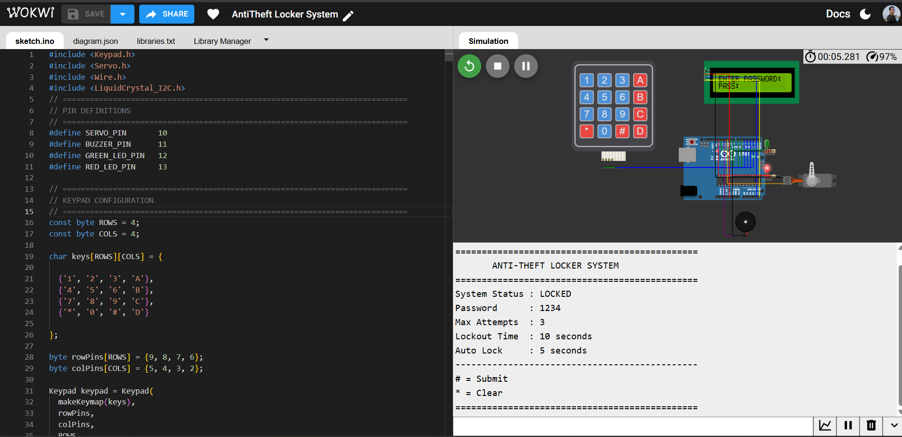
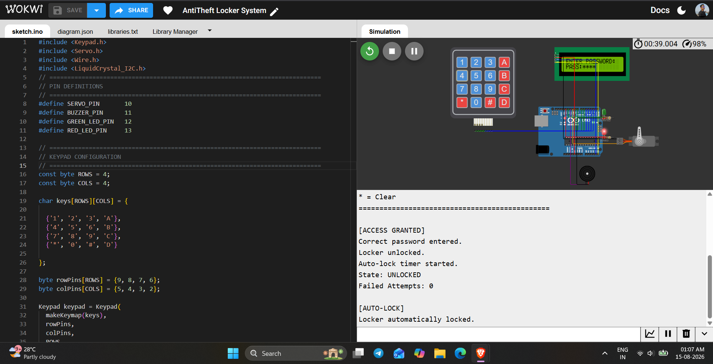
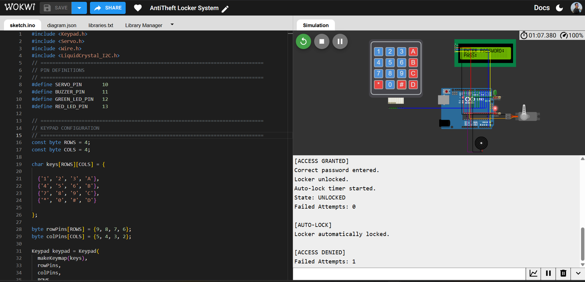
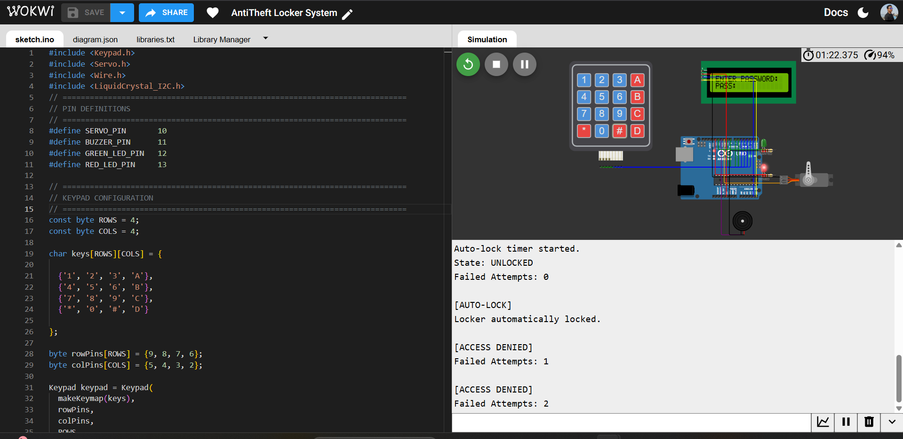
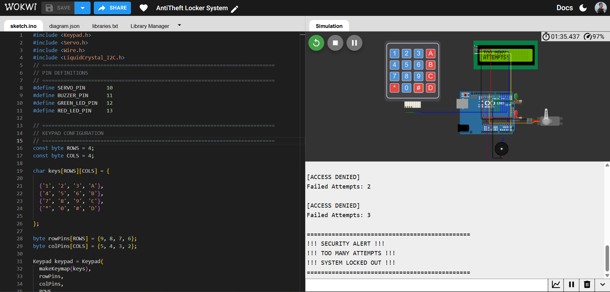

# 🔒 Anti-Theft Locker — Arduino Access-Control Embedded System


<p align="center">

[▶️ **Run Live Wokwi Simulation**](https://wokwi.com/projects/472327786263779329)

</p>

> An Arduino UNO-based electronic access-control system built around a clean three-state Finite State Machine: PIN authentication via 4×4 keypad, masked LCD input, SG90 servo locking, non-blocking automatic relocking, three-strike failed-attempt detection, and a timed security lockout with alarm — the same control pattern found in real electronic door locks and safe mechanisms.

**📄 [sketch.ino](sketch.ino) &nbsp;|&nbsp; 🖼️ [Output](#-output)**

---

## 💼 Why This Project Matters

This project is a clean demonstration of **state-machine-driven embedded design** — one of the most transferable skills in firmware engineering. Rather than a tangle of flags and `if` statements, the system is built around three explicit states (`LOCKED`, `UNLOCKED`, `LOCKOUT`), each with clearly owned responsibilities, non-blocking `millis()`-based timing for the relock and lockout windows, and a deliberate security response to repeated failed authentication. It also shows security-mindedness beyond the code itself: the README includes an honest section on what a real production version would still need — exactly the kind of judgment that separates a working demo from an engineer who understands the domain.

**At a glance:**

| | |
|---|---|
| 🎯 **Role demonstrated** | Embedded Firmware Engineer — access control & security systems |
| 🔧 **Core stack** | Arduino UNO · C/C++ · Finite State Machine · I2C · PWM |
| 🧪 **Validation** | 9 test cases covering auth, relock, and lockout — all verified |
| 📦 **Deliverables** | Firmware, circuit definition, telemetry, documented test evidence |

---

## 📑 Table of Contents

1. [Project Overview](#-project-overview)
2. [Objectives](#-objectives)
3. [Key Features](#-key-features)
4. [System Architecture](#️-system-architecture)
5. [Finite State Machine & Authentication Logic](#-finite-state-machine--authentication-logic)
6. [Servo Locking Mechanism](#-servo-locking-mechanism)
7. [Automatic Relocking](#️-automatic-relocking)
8. [Failed-Attempt Detection & Security Lockout](#-failed-attempt-detection--security-lockout)
9. [LED & Buzzer Status](#-led--buzzer-status)
10. [LCD Display](#️-lcd-display)
11. [Keypad Operation](#-keypad-operation)
12. [Pin Configuration](#-pin-configuration)
13. [Firmware Parameters](#️-firmware-parameters)
14. [Firmware Architecture](#-firmware-architecture)
15. [Technology Stack](#️-technology-stack)
16. [How to Run the Project](#️-how-to-run-the-project)
17. [Repository Structure](#-repository-structure)
18. [Testing and Validation](#-testing-and-validation)
19. [Output](#-output)
20. [Security Considerations](#-security-considerations)
21. [Project Limitations](#️-project-limitations)
22. [Roadmap](#-roadmap)
23. [Skills Demonstrated](#-skills-demonstrated)
24. [Author](#-author)
25. [License](#-license)

---

## 📌 Project Overview

The **Anti-Theft Locker** is an Arduino UNO electronic access-control prototype that demonstrates how authentication, hardware interfacing, actuator control, timing logic, and security response combine into a complete embedded system.

A **4×4 matrix keypad** handles PIN entry, a **16×2 I2C LCD** provides masked-input feedback, an **SG90 servo** simulates the physical locking mechanism, green/red LEDs give status indication, and a piezo buzzer provides audible feedback and the lockout alarm.

The firmware is structured as a **three-state Finite State Machine** — `LOCKED_STATE`, `UNLOCKED_STATE`, `LOCKOUT_STATE`. A correct PIN unlocks the system for ~5 seconds before automatic relock; three consecutive incorrect attempts trigger a **10-second lockout** with keypad blocking and an alternating alarm. The full system — authentication, actuation, and security response — was designed and functionally validated end-to-end in **Wokwi**.

---

## 🎯 Objectives

* Implement PIN-based electronic locker authentication.
* Interface a 4×4 matrix keypad with the Arduino UNO.
* Mask password input on a 16×2 I2C LCD.
* Drive an SG90 servo as a simulated locking mechanism.
* Structure system control around a Finite State Machine.
* Automatically relock the locker after successful authentication.
* Detect consecutive failed attempts and trigger a security lockout.
* Provide visual (LED) and audible (buzzer) status feedback.
* Report live system information via the Serial Monitor.
* Demonstrate a complete, security-aware Arduino access-control architecture.

---

## ✨ Key Features

* PIN-based authentication via a 4×4 matrix keypad
* Masked password display (`*`) on the LCD — `*` clears, `#` submits
* Three-strike failed-attempt detection with a 10-second security lockout
* SG90 servo-based locking — unlock at 90°, lock at 0°
* Non-blocking `millis()`-based automatic relock ~5 seconds after unlock
* Green LED on unlock; red LED on lock/alarm, flashing during lockout
* Distinct buzzer tones for keypress, access granted, access denied, and the alternating lockout alarm
* Clean three-state FSM architecture (`LOCKED` / `UNLOCKED` / `LOCKOUT`)
* 9600-baud Serial telemetry
* Fully validated in Wokwi simulation

---

## 🏗️ System Architecture

```text
                           ┌─────────────────────┐
                           │     Arduino UNO     │
                           │     ATmega328P      │
                           └──────────┬──────────┘
                                      │
              ┌───────────────────────┼────────────────────────┐
              │                       │                        │
              ▼                       ▼                        ▼
     ┌─────────────────┐     ┌─────────────────┐     ┌─────────────────┐
     │   4×4 Matrix    │     │   16×2 I2C LCD  │     │ UART Serial     │
     │     Keypad      │     │     Display     │     │    Monitor      │
     └────────┬────────┘     └─────────────────┘     └─────────────────┘
              │
              ▼
     ┌─────────────────────┐
     │ Password Processing │
     │ & Authentication    │
     └──────────┬──────────┘
                │
                ▼
     ┌──────────────────────┐
     │ Finite State Machine │
     │  LOCKED / UNLOCKED /  │
     │       LOCKOUT         │
     └──────────┬──────────┘
                │
       ┌────────┼──────────────┬─────────────┐
       │        │              │             │
       ▼        ▼              ▼             ▼
    ┌──────┐ ┌──────┐     ┌────────┐    ┌────────┐
    │ SG90 │ │Buzzer│     │ Green  │    │  Red   │
    │Servo │ │      │     │  LED   │    │  LED   │
    └──┬───┘ └──────┘     └────────┘    └────────┘
       │
       ▼
 ┌────────────────────┐
 │ Locker / Deadbolt  │
 │ Status Simulation  │
 └────────────────────┘
```

---

## 🔄 Finite State Machine & Authentication Logic

```text
                         ┌──────────────────────┐
                         │     LOCKED_STATE      │
                         │  Servo = 0°, Red LED  │
                         └──────────┬───────────┘
                                    │
                          Enter PIN → Press '#'
                                    │
                         ┌──────────▼───────────┐
                         │   PIN VALIDATION      │
                         └───────┬────────┬─────┘
                              VALID    INVALID
                                 │        │
                                 ▼        ▼
                    ┌────────────────┐  ┌──────────────────┐
                    │ UNLOCKED_STATE │  │  ACCESS DENIED    │
                    │ Servo = 90°    │  │  Fail Count + 1   │
                    │ Green LED ON   │  └────────┬──────────┘
                    └───────┬────────┘           │
                            │              Attempts < 3 → Try again
                        ~5 sec                    │
                            │              Attempts ≥ 3
                            ▼                      │
                     LOCKED_STATE                  ▼
                                      ┌────────────────────┐
                                      │   LOCKOUT_STATE     │
                                      │ Servo = 0°           │
                                      │ Keypad blocked       │
                                      │ Alarm + flashing LED │
                                      └─────────┬───────────┘
                                                 │
                                              10 sec
                                                 │
                                                 ▼
                                     Reset counter → LOCKED_STATE
```

**Default prototype PIN:** `1234`

> **Note:** The PIN is intentionally visible in source for this educational prototype — see [Security Considerations](#-security-considerations) for what would need to change in production.

On a valid PIN, the system moves the servo to 90°, turns the green LED on, plays a confirmation tone, and starts the auto-lock timer. On an invalid PIN, it increments the failed-attempt counter, plays a warning tone, and shows remaining attempts — until the third failure triggers `LOCKOUT_STATE`.

---

## 🔓 Servo Locking Mechanism

| System State | Servo Position | Meaning |
|---|---:|---|
| `LOCKED_STATE` | 0° | Locker locked |
| `UNLOCKED_STATE` | 90° | Locker unlocked |
| `LOCKOUT_STATE` | 0° | Locker remains locked |

```cpp
const byte LOCK_ANGLE = 0;
const byte UNLOCK_ANGLE = 90;
```

---

## ⏱️ Automatic Relocking

```cpp
const unsigned long AUTO_LOCK_DELAY = 5000UL;
```

```text
Access Granted → Servo 90°, Green LED ON → millis() timer starts
        ↓
   ~5 seconds elapse
        ↓
Servo 0°, Red LED ON → Return to LOCKED_STATE
```

The primary relock and lockout timers are fully non-blocking, driven by `millis()` rather than `delay()`.

> **Implementation note:** short `delay()` calls are still used in some UI/buzzer feedback routines — only the relock and lockout timing logic is fully non-blocking.

---

## 🚨 Failed-Attempt Detection & Security Lockout

```cpp
const byte MAX_FAILED_ATTEMPTS = 3;
const unsigned long LOCKOUT_TIME = 10000UL;
```

```text
3rd Consecutive Failed Attempt
   → LOCKOUT_STATE → Servo stays at 0°, keypad blocked
   → Red LED alternates 250 ms, buzzer alternates 1200 Hz ↔ 800 Hz
   → After 10 seconds → counter resets → LOCKED_STATE
```

The alarm and LED alternation run on a `millis()`-based 250 ms timer. This guarantees a persistent, unmistakable response to repeated unauthorized access attempts.

---

## 🚦 LED & Buzzer Status

| System Condition | Green LED | Red LED | Buzzer |
|---|---|---|---|
| `LOCKED_STATE` | OFF | ON | Silent |
| Keypress | State dependent | State dependent | 2000 Hz / 50 ms |
| `UNLOCKED_STATE` | ON | OFF | 1000 Hz → 1500 Hz |
| Access denied | OFF | ON | 400 Hz / 500 ms |
| `LOCKOUT_STATE` | OFF | Alternating | 1200 Hz ↔ 800 Hz |

---

## 🖥️ LCD Display

| Screen | Content |
|---|---|
| Standby | `ENTER PASSWORD:` / `PASS:****` |
| Access Granted | `ACCESS GRANTED` / `LOCKER OPEN` |
| Access Denied | `ACCESS DENIED` / `TRIES LEFT: 2` |
| Security Lockout | `TOO MANY` / `ATTEMPTS!` |
| Automatic Relock | `LOCKER LOCKED` / `SECURE` |
| Lockout Recovery | `LOCKOUT ENDED` / `TRY AGAIN` |

---

## 🔢 Keypad Operation

```text
┌─────┬─────┬─────┬─────┐
│  1  │  2  │  3  │  A  │
├─────┼─────┼─────┼─────┤
│  4  │  5  │  6  │  B  │
├─────┼─────┼─────┼─────┤
│  7  │  8  │  9  │  C  │
├─────┼─────┼─────┼─────┤
│  *  │  0  │  #  │  D  │
└─────┴─────┴─────┴─────┘
```

| Key | Function |
|---|---|
| `0–9` | Enter password digit |
| `*` | Clear current password input |
| `#` | Submit password |
| `A–D` | Ignored |

Password input is capped at a configured maximum of **8 characters**.

---

## 🔌 Pin Configuration

| Component | Module Pin | Arduino UNO Pin | Function |
|---|---|---|---|
| 4×4 Matrix Keypad | Row 1–4 | D9, D8, D7, D6 | Matrix rows |
| 4×4 Matrix Keypad | Col 1–4 | D5, D4, D3, D2 | Matrix columns |
| I2C LCD | SDA / SCL | A4 / A5 | I2C data / clock |
| I2C LCD | VCC / GND | 5V / GND | Power |
| SG90 Servo | Signal | D10 | PWM control |
| SG90 Servo | VCC / GND | 5V / GND | Power |
| Piezo Buzzer | Positive / GND | D11 / GND | Audio output |
| Green LED | Anode | D12 via 220Ω | Unlock indicator |
| Red LED | Anode | D13 via 220Ω | Lock / alarm indicator |

---

## ⚙️ Firmware Parameters

| Parameter | Value |
|---|---:|
| Default PIN | `1234` |
| Maximum Password Length | 8 characters |
| Lock Angle | 0° |
| Unlock Angle | 90° |
| Auto-Lock Delay | 5000 ms |
| Maximum Failed Attempts | 3 |
| Lockout Duration | 10000 ms |
| Alarm Frequencies | 1200 Hz / 800 Hz |
| Alarm Toggle Rate | 250 ms |
| Keypress Tone | 2000 Hz / 50 ms |
| Access Denied Tone | 400 Hz / 500 ms |
| Access Granted Tone | 1000 Hz → 1500 Hz |
| UART Baud Rate | 9600 |
| LCD I2C Address / Size | `0x27` / 16×2 |

---

## 🧠 Firmware Architecture

```cpp
enum SystemState {
    LOCKED_STATE,
    UNLOCKED_STATE,
    LOCKOUT_STATE
};
```

| State | Responsibility |
|---|---|
| `LOCKED_STATE` | Normal secure standby and password authentication |
| `UNLOCKED_STATE` | Temporary authorized access |
| `LOCKOUT_STATE` | Security response after three failed attempts |

**Major firmware functions:**

```text
initializeHardware(), showWelcomeScreen(), showPasswordScreen()
processKey(), handleDigit(), handleSubmit(), handleClear()
checkPassword(), grantAccess(), lockLocker(), denyAccess()
triggerLockout(), handleLockout()
resetPasswordInput(), updatePasswordDisplay()
setLockedIndicators(), setUnlockedIndicators(), setAlarmIndicators(), stopAlarm()
beepKey(), beepAccessGranted(), beepAccessDenied()
printSystemStatus()
```

---

## 🛠️ Technology Stack

**Hardware:** Arduino UNO (ATmega328P) · 4×4 Matrix Keypad · SG90 Servo Motor · 16×2 I2C LCD (PCF8574) · Piezoelectric Buzzer · Green/Red LEDs · 220Ω Resistors

**Software:** Embedded C/C++ · Arduino Core · `Keypad.h` · `Servo.h` · `Wire.h` · `LiquidCrystal_I2C.h` · Wokwi Electronics Simulator

---

## ▶️ How to Run the Project

### 1. Open the Live Simulation
**[▶️ Open Live Wokwi Simulation](https://wokwi.com/projects/472327786263779329)** — includes the firmware, circuit (`diagram.json`), and required libraries (`libraries.txt`).

### 2. Start the Simulation
Click **▶ Start Simulation**. The system initializes the keypad, LCD, servo, buzzer, LEDs, and Serial Monitor.

### 3. Test Successful Authentication
Enter `1234#`. Expect `ACCESS GRANTED` → servo to 90°, green LED on → ~5-second timer → servo to 0°, red LED on → back to `LOCKED_STATE`.

### 4. Test Failed Authentication
Enter an incorrect PIN (e.g. `9999#`) twice. Expect `ACCESS DENIED` with decreasing "tries left" on the LCD.

### 5. Test Security Lockout
Enter a third incorrect PIN. Expect `TOO MANY ATTEMPTS!`, keypad blocked, red LED alternating, buzzer alarm for 10 seconds, then automatic reset to `LOCKED_STATE`.

---

## 📂 Repository Structure

```text
Anti-Theft-Locker-Embedded-System/
│
├── Output/
│   ├── 01_Running.png
│   ├── 02_Password_Enter.png
│   ├── 03_Test-1.png
│   ├── 04_Test-2.png
│   └── 05_Test-3.png
│
├── sketch.ino
├── diagram.json
├── libraries.txt
└── README.md
```

---

## 🧪 Testing and Validation

| Test Case | Input / Condition | Expected Result |
|---|---|---|
| Initial Boot | Start simulation | `LOCKED_STATE`, red LED ON, servo at 0° |
| Password Entry | Enter numeric PIN | LCD displays masked `*` characters |
| Clear Input | Press `*` | Password input cleared |
| Valid Authentication | `1234#` | Access granted, servo moves to 90° |
| Automatic Relock | Wait ~5 seconds | Servo returns to 0° |
| Failed Attempt 1 & 2 | Incorrect PIN | Access denied, remaining attempts shown |
| Failed Attempt 3 | Incorrect PIN | Security lockout triggered |
| Lockout Alarm | During lockout | Red LED flashes, buzzer alternates |
| Lockout Recovery | Wait 10 seconds | Counter resets, system returns to `LOCKED_STATE` |

**9 / 9 test cases verified**, each documented with corresponding output evidence below.

---

## 📸 Output

### Initial Running State

`State: LOCKED | Servo: 0° | Red LED: ON`

### Password Entry & Masking

`LCD: PASS:**** (masked input)`

### Successful Authentication

`State: UNLOCKED | Servo: 90° | Green LED: ON`

### Failed Authentication

`Access Denied | Tries Left: 2`

### Security Lockout

`State: LOCKOUT | Keypad Blocked | Alarm: ACTIVE`

---

## 🔐 Security Considerations

This is an **educational embedded-system prototype**, not a production-grade security product — the prototype PIN (`1234`) is intentionally visible in source.

A production implementation would additionally need:

* Secure credential storage instead of hard-coded credentials
* Password change functionality
* EEPROM or dedicated secure non-volatile storage
* Stronger authentication mechanisms and physical tamper detection
* Persistent, timestamped security event logging
* Encrypted communication for remote connectivity
* Protection against credential disclosure and secure key management

---

## ⚠️ Project Limitations

* Authentication credentials are stored directly in firmware
* The SG90 servo represents the locking mechanism for simulation purposes only
* No physical tamper sensor
* No persistent access log or remote notification mechanism
* Validated through Wokwi simulation rather than physical hardware deployment

---

## 🚀 Roadmap

| Area | Planned Enhancements |
|---|---|
| 🔑 **Authentication** | RFID (MFRC522) dual-factor with PIN, administrator password management, multi-user support |
| 💾 **Storage** | EEPROM-based credential storage |
| 🌐 **Connectivity** | Bluetooth (HC-05) or Wi-Fi (ESP32), cloud alerts via MQTT, remote mobile/web monitoring |
| 📋 **Logging** | RTC-based access logging (DS3231) with timestamped events |
| 🔋 **Power** | Battery operation with voltage monitoring |
| 🛡️ **Physical Security** | Tamper detection, encrypted communication for remote access |

---

## 💼 Skills Demonstrated

Embedded C/C++ · Arduino UNO / ATmega328P programming · Finite State Machine design · matrix keypad interfacing · I2C communication · LCD programming · servo/PWM control · buzzer tone generation · non-blocking `millis()` timing · failed-attempt detection & security lockout logic · input validation and password masking · GPIO control · Wokwi simulation · Serial debugging · Git/GitHub · technical documentation.

---

## 👤 Author

**Subham Bhattacherjee**
**Project:** Anti-Theft Locker Embedded System
**GitHub:** [github.com/Subhamrbj](https://github.com/Subhamrbj) · [View Repository](https://github.com/Subhamrbj/Anti-Theft-Locker-Embedded-System)
**Live Simulation:** [wokwi.com/projects/472327786263779329](https://wokwi.com/projects/472327786263779329)

---

## 📜 License

Licensed under the **MIT License** — free to use, modify, and distribute for personal, academic, or commercial purposes, with attribution appreciated.

---

## ⭐ Project Summary

* Designed a clean **three-state Finite State Machine** (`LOCKED` / `UNLOCKED` / `LOCKOUT`) to structure all system behavior — no scattered flags or ad-hoc logic.
* Implemented **non-blocking `millis()`-based timing** for the automatic relock and security lockout windows.
* Built a **three-strike failed-attempt detection system** with a distinct alarm state, alternating LED/buzzer feedback, and automatic recovery.
* Interfaced a **4×4 matrix keypad, I2C LCD, SG90 servo, and buzzer** into one coordinated authentication flow with masked password entry.
* Documented **explicit security considerations and limitations** — showing awareness of the gap between a working prototype and a production-grade access-control product.
* Verified **9 distinct test cases** covering the full authentication, relock, and lockout lifecycle.
* Structured for reproducibility: `sketch.ino`, `diagram.json`, `libraries.txt`, `Output/`, and a public Wokwi simulation link.

> **Project Type:** Embedded Systems / Access Control / Security &nbsp;·&nbsp; **Platform:** Arduino UNO &nbsp;·&nbsp; **Language:** Embedded C/C++ &nbsp;·&nbsp; **Architecture:** Finite State Machine &nbsp;·&nbsp; **Simulation:** Wokwi
