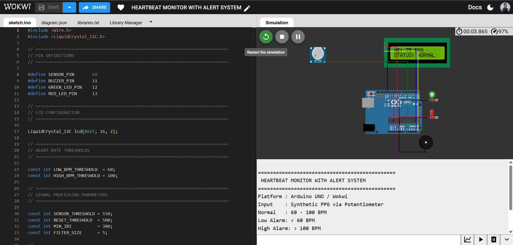
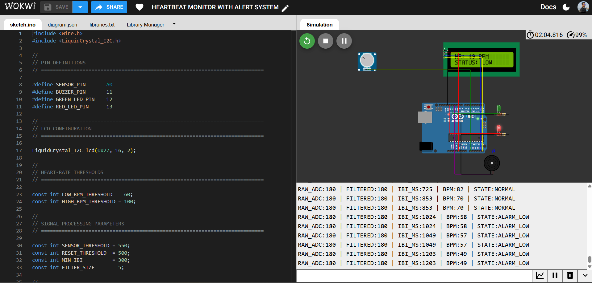
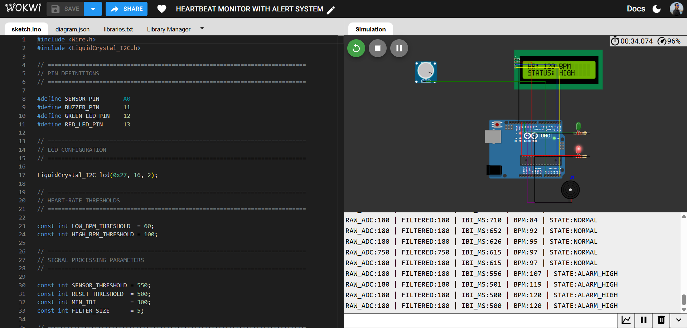

# ❤️ Heartbeat Monitor with Alert System — Arduino Embedded Signal Processing


> An Arduino UNO-based real-time signal-processing pipeline that acquires a pulse waveform, filters it, detects peaks, measures inter-beat intervals, computes BPM, classifies heart-rate state, and drives LCD/LED/buzzer feedback — the same acquire → filter → detect → decide → alert architecture used in real biomedical and wearable-health firmware.

**🔗 [Live Wokwi Simulation](https://wokwi.com/projects/472334564347172865) &nbsp;|&nbsp; 📄 [sketch.ino](#) &nbsp;|&nbsp; 🖼️ [Simulation Outputs](#-simulation-outputs)**

---

## 💼 Why This Project Matters

This project demonstrates a complete embedded **digital signal processing (DSP) pipeline** built from scratch on constrained hardware — not just a sensor readout. It covers analog acquisition, noise filtering, edge-triggered peak detection with hysteresis, timing-based feature extraction (IBI), a real formula-driven calculation (BPM), threshold classification, and multi-channel output arbitration (LCD + dual LED + buzzer) — all running in a single real-time `loop()` on an 8-bit microcontroller. It's the same shape of problem found in wearables, patient monitors, and fitness trackers.

**At a glance:**

| | |
|---|---|
| 🎯 **Role demonstrated** | Embedded Firmware Engineer / Biomedical & IoT Systems Developer |
| 🔧 **Core stack** | Arduino UNO · C/C++ · I2C LCD · Analog Signal Processing |
| 🧪 **Validation** | 3 classified operating states, verified via live Serial telemetry |
| 📦 **Deliverables** | Firmware, circuit definition, telemetry logs, documented test evidence |

---

## 📑 Table of Contents

1. [Overview](#-overview)
2. [Problem Statement](#-problem-statement)
3. [Educational Disclaimer](#️-educational-disclaimer)
4. [Industry Relevance](#-industry-relevance)
5. [Features](#-features)
6. [Components Used](#-components-used)
7. [Embedded Concepts Applied](#-embedded-concepts-applied)
8. [Signal Processing Pipeline](#-signal-processing-pipeline)
9. [BPM Calculation](#️-bpm-calculation)
10. [System Architecture](#️-system-architecture)
11. [Circuit Connections](#-circuit-connections)
12. [BPM Classification](#-bpm-classification)
13. [Folder Structure](#-folder-structure)
14. [Installation](#️-installation)
15. [Simulation & How to Run](#️-simulation--how-to-run)
16. [Simulation Outputs](#-simulation-outputs)
17. [Test Results](#-test-results)
18. [Limitations](#️-limitations)
19. [Roadmap](#-roadmap)
20. [Learning Outcomes](#-learning-outcomes)
21. [Author](#-author)
22. [License](#-license)

---

## 📌 Overview

The **Heartbeat Monitor with Alert System** is an Arduino UNO embedded prototype, fully validated in **Wokwi**, that models the end-to-end firmware behind a heart-rate monitoring device. A potentiometer generates a controllable synthetic PPG-like pulse signal; the UNO reads it on an analog pin, smooths it with a moving-average filter, detects beat peaks with hysteresis, measures the **Inter-Beat Interval (IBI)**, computes **BPM**, classifies the result against clinically-inspired thresholds, and drives a **16×2 I2C LCD**, dual-color LED indicators, and a buzzer accordingly.

Everything — signal generation, filtering, detection, and decision-making — runs in real time inside a single Arduino sketch, with structured Serial telemetry exposing every stage of the pipeline for verification.

---

## 🎯 Problem Statement

A heart-rate monitoring system must reliably: acquire a pulse signal, filter out noise, identify the timing between successive beats, convert that timing into BPM, classify the result, and communicate the outcome — all in real time, with no missed or double-counted beats.

This project builds and validates that pipeline end-to-end using an Arduino UNO and a controllable synthetic pulse signal, covering:

* Analog signal acquisition
* Synthetic pulse generation (for repeatable, hardware-free testing)
* Moving-average filtering
* Hysteresis-based peak detection
* Inter-Beat Interval measurement
* BPM calculation
* Threshold-based classification
* LCD interfacing (I2C)
* Serial telemetry
* LED-based status indication
* Audible alarm generation

---

## ⚠️ Educational Disclaimer

> **This is strictly an educational embedded-systems prototype and simulation. It is not a medical device and must not be used for medical diagnosis, treatment, emergency monitoring, or clinical decision-making.**

The signal source is a **potentiometer-generated synthetic PPG-like waveform** in Wokwi, not a real pulse sensor. The BPM thresholds are demonstration values for the simulation, not medical guidance. A real healthcare device would additionally require validated sensors, calibration, rigorous signal processing, clinical evaluation, safety testing, and regulatory approval.

---

## 🏭 Industry Relevance

| Domain | Application in this project |
|---|---|
| **Wearable Health Tech** | Real-time pulse acquisition and BPM computation |
| **Biomedical Embedded Systems** | Filtering, peak detection, and physiological signal interpretation |
| **IoT Healthcare** | Local edge processing with alert generation |
| **Patient Monitoring** | Threshold-based state classification and alarms |
| **Fitness & Consumer Devices** | The same acquire → process → display → alert loop used in commercial trackers |

**Engineering skills demonstrated:** Arduino/embedded C/C++ · analog signal acquisition · digital filtering · peak detection with hysteresis · time-domain feature extraction · real-time classification logic · I2C display interfacing · multi-output alarm arbitration · Serial telemetry · simulation-based validation.

---

## ✨ Features

* Arduino UNO-based real-time signal-processing firmware
* Controllable synthetic PPG-like pulse generation via potentiometer
* Analog acquisition on `A0`
* 5-sample moving-average filter for noise smoothing
* Hysteresis-based peak detection (dual threshold, prevents false triggers)
* Inter-Beat Interval (IBI) measurement with a minimum-interval guard
* BPM calculation from IBI, constrained to a realistic 30–220 range
* Three-state classification: **LOW / NORMAL / HIGH**
* 16×2 I2C LCD live status display
* Green LED (normal) / Red LED (alarm, with distinct blink rates per state)
* Buzzer-driven audible alarm
* Structured Serial telemetry (`RAW_ADC`, `FILTERED`, `IBI_MS`, `BPM`, `STATE`)
* Fully reproducible in Wokwi — no physical hardware required to demo

---

## 🧩 Components Used

| Component | Qty | Purpose |
|---|---:|---|
| Arduino UNO | 1 | Main microcontroller |
| Potentiometer | 1 | Synthetic pulse/PPG signal input |
| 16×2 I2C LCD | 1 | BPM and status display |
| Green LED | 1 | Normal status indication |
| Red LED | 1 | Alarm indication |
| 220Ω Resistor | 2 | LED current limiting |
| Buzzer | 1 | Audible alarm |

**Software/Tools:** [Wokwi](https://wokwi.com) (circuit simulation) · Arduino IDE (firmware development) · `LiquidCrystal I2C` library.

---

## 🧠 Embedded Concepts Applied

`Microcontroller Programming` · `Analog Signal Acquisition (ADC)` · `Synthetic Signal Generation` · `Moving-Average Filtering` · `Hysteresis-Based Peak Detection` · `Time-Domain Feature Extraction (IBI)` · `Threshold Classification` · `I2C Communication` · `Digital Output Control` · `Serial Telemetry` · `Real-Time Timing (millis())` · `Simulation-Based Testing`

---

## 🔬 Signal Processing Pipeline

### 1. Analog Signal Acquisition
```cpp
#define SENSOR_PIN A0
analogRead(SENSOR_PIN);
```

### 2. Synthetic Pulse Generation
The potentiometer position maps to a pulse period, letting one control panel sweep across the full clinical range without extra hardware:

```text
1500 ms → ~40 BPM
1000 ms → ~60 BPM
800 ms  → ~75 BPM
600 ms  → ~100 BPM
428 ms  → ~140 BPM
```

### 3. Moving-Average Filtering
```cpp
const int FILTER_SIZE = 5;
```
Five samples are buffered and averaged before peak detection to suppress noise.

### 4. Hysteresis-Based Peak Detection
```cpp
const int SENSOR_THRESHOLD = 550;  // beat trigger
const int RESET_THRESHOLD  = 500;  // must fall below before re-arming
```
The signal must drop below the reset threshold before another peak can register — standard debounce logic for physiological waveforms.

### 5. Inter-Beat Interval Measurement
```text
IBI = Current Beat Time − Previous Beat Time
```
```cpp
const int MIN_IBI = 300;  // rejects unrealistically fast triggers
```

---

## ❤️ BPM Calculation

```text
BPM = 60,000 / IBI
```

**Example:** `IBI = 800 ms → BPM = 60,000 / 800 = 75 BPM`

```cpp
int rawBPM = 60000UL / ibi;
```

The result is constrained to **30–220 BPM** for simulation stability.

---

## 🏗️ System Architecture

```text
                    ┌─────────────────────────┐
                    │      POTENTIOMETER      │
                    │  Synthetic Pulse Input  │
                    └────────────┬────────────┘
                                 │
                                 ▼
                          ┌─────────────────┐
                          │ Arduino UNO A0  │
                          │  Analog Input   │
                          └────────┬────────┘
                                   │
                                   ▼
                      ┌────────────────────────┐
                      │ Synthetic Pulse        │
                      │ Generation             │
                      └───────────┬────────────┘
                                  │
                                  ▼
                      ┌────────────────────────┐
                      │ Moving Average Filter  │
                      └───────────┬────────────┘
                                  │
                                  ▼
                      ┌────────────────────────┐
                      │ Peak Detection         │
                      └───────────┬────────────┘
                                  │
                                  ▼
                      ┌────────────────────────┐
                      │ IBI Measurement        │
                      └───────────┬────────────┘
                                  │
                                  ▼
                      ┌────────────────────────┐
                      │ BPM Calculation        │
                      └───────────┬────────────┘
                                  │
                                  ▼
                      ┌────────────────────────┐
                      │ State Evaluation       │
                      └───────────┬────────────┘
                                  │
                       ┌──────────┼──────────┐
                       │          │          │
                       ▼          ▼          ▼
                    NORMAL       LOW        HIGH
                                ALARM      ALARM
                       │          │          │
                       ▼          ▼          ▼
                   Green LED   Red LED    Red LED
                                + Buzzer   + Buzzer
                                  │
                                  ▼
                         ┌──────────────────┐
                         │   16×2 I2C LCD   │
                         │   BPM + Status   │
                         └──────────────────┘
                                  │
                                  ▼
                         ┌──────────────────┐
                         │  Serial Monitor  │
                         │  Real-Time Data  │
                         └──────────────────┘
```

---

## 🔌 Circuit Connections

| Component | Pin | Arduino UNO |
|---|---|---|
| Potentiometer | GND | GND |
| Potentiometer | VCC | 5V |
| Potentiometer | SIG | A0 |
| LCD | VCC | 5V |
| LCD | GND | GND |
| LCD | SDA | A4 |
| LCD | SCL | A5 |
| Buzzer | Signal | D11 |
| Buzzer | GND | GND |
| Green LED | Anode | D12 |
| Green LED | Cathode | 220Ω → GND |
| Red LED | Anode | D13 |
| Red LED | Cathode | 220Ω → GND |

---

## 🚦 BPM Classification

```cpp
const int LOW_BPM_THRESHOLD  = 60;
const int HIGH_BPM_THRESHOLD = 100;
```

| BPM Range | State | Green LED | Red LED | Buzzer |
|---|---|---|---|---|
| Below 60 BPM | LOW ALARM | OFF | Blinking | ON |
| 60–100 BPM | NORMAL | ON | OFF | OFF |
| Above 100 BPM | HIGH ALARM | OFF | Fast Blinking | ON |

---

## 📁 Folder Structure

```text
03-Heartbeat-Monitor-Alert-Embedded-System/
│
├── Output/
│   ├── normal.png
│   ├── low-alert.png
│   └── high-alert.png
│
├── README.md
├── diagram.json
├── libraries.txt
└── sketch.ino
```

| File / Folder | Purpose |
|---|---|
| `sketch.ino` | Main Arduino Embedded C/C++ source code |
| `diagram.json` | Wokwi circuit configuration |
| `libraries.txt` | Required Wokwi library configuration |
| `Output/` | Simulation output screenshots |
| `README.md` | Project documentation |

---

## ⚙️ Installation

No physical hardware is required to demo — the project runs entirely in Wokwi.

1. (Optional, for real hardware) Install the [Arduino IDE](https://www.arduino.cc/en/software).
2. Install the required library via **Library Manager**: `LiquidCrystal I2C` (also declared in `libraries.txt`).
3. Wire the circuit per [Circuit Connections](#-circuit-connections), or open `diagram.json` directly in [Wokwi](https://wokwi.com).
4. Open `sketch.ino` in the Arduino IDE, select **Arduino Uno**, and upload — or simulate directly in Wokwi.

---

## ▶️ Simulation & How to Run

1. Open the Wokwi project: **[wokwi.com/projects/472334564347172865](https://wokwi.com/projects/472334564347172865)**
2. Click **Start Simulation** — the LCD shows a startup screen (`HEART MONITOR` / `INITIALIZING...`), then live BPM and status.
3. Rotate the **potentiometer** to sweep the simulated pulse rate between `NORMAL`, `LOW ALARM`, and `HIGH ALARM`.
4. Watch the LED/buzzer response:

   | Condition | Green LED | Red LED | Buzzer |
   |---|---|---|---|
   | Normal | ON | OFF | OFF |
   | Low Alarm | OFF | Blinking | ON |
   | High Alarm | OFF | Fast Blinking | ON |

5. Open the **Serial Monitor** for live telemetry (`RAW_ADC`, `FILTERED`, `IBI_MS`, `BPM`, `STATE`).

To run on real hardware: wire per the Circuit Connections table, upload `sketch.ino` via Arduino IDE, and open the Serial Monitor at the configured baud rate.

---

## 📸 Simulation Outputs

### 1. Normal Heart Rate

```text
Green LED → ON   |   Red LED → OFF   |   Buzzer → OFF   |   LCD → STATUS: NORMAL
```

### 2. Low Heart Rate Alarm

```text
Green LED → OFF   |   Red LED → Blinking   |   Buzzer → ON   |   LCD → STATUS: LOW
```

### 3. High Heart Rate Alarm

```text
Green LED → OFF   |   Red LED → Fast Blinking   |   Buzzer → ON   |   LCD → STATUS: HIGH
```

---

## 🧪 Test Results

### Test Case 1 — Normal (60–100 BPM)
```text
LCD Status: NORMAL | Green LED: ON | Red LED: OFF | Buzzer: OFF

IBI_MS:725 | BPM:82 | STATE:NORMAL
IBI_MS:853 | BPM:70 | STATE:NORMAL
```

### Test Case 2 — Low Alarm (BPM < 60)
```text
LCD Status: LOW | Green LED: OFF | Red LED: Blinking | Buzzer: ON

IBI_MS:1024 | BPM:58 | STATE:ALARM_LOW
IBI_MS:1049 | BPM:57 | STATE:ALARM_LOW
IBI_MS:1203 | BPM:49 | STATE:ALARM_LOW
```

### Test Case 3 — High Alarm (BPM > 100)
```text
LCD Status: HIGH | Green LED: OFF | Red LED: Fast Blinking | Buzzer: ON

IBI_MS:556 | BPM:107 | STATE:ALARM_HIGH
IBI_MS:501 | BPM:119 | STATE:ALARM_HIGH
IBI_MS:500 | BPM:120 | STATE:ALARM_HIGH
```

### Summary

| Test Case | BPM Condition | LCD | Green LED | Red LED | Buzzer |
|---|---|---|---|---|---|
| Normal | 60–100 BPM | NORMAL | ON | OFF | OFF |
| Low Alarm | <60 BPM | LOW | OFF | Blinking | ON |
| High Alarm | >100 BPM | HIGH | OFF | Fast Blinking | ON |

**3 / 3 classification states verified** via live telemetry and screenshot evidence — see `Output/`.

---

## ⚠️ Limitations

* **Synthetic pulse input** — a potentiometer generates the PPG-like signal; no physical pulse sensor is used.
* **Simulation-based** — validated in Wokwi, not on a physical patient-measurement system.
* **Basic signal processing** — a simple moving-average filter and threshold-based peak detection are used; real biomedical signals typically need considerably more advanced processing.
* **Fixed thresholds** — `<60`, `60–100`, `>100` BPM are demonstration values, not medical recommendations.
* **No motion-artifact handling.**
* **No historical data storage** — readings aren't persisted beyond the session.
* **No wireless connectivity** — the UNO implementation has no Wi-Fi/Bluetooth/cloud link.
* **No mobile application** — output is limited to LCD and Serial Monitor.
* **No medical validation, clinical testing, or regulatory certification.**

---

## 🚀 Roadmap

| Area | Planned Enhancements |
|---|---|
| 🔧 **Hardware** | Real pulse/PPG sensor (e.g. MAX30102), OLED upgrade, move to ESP32, battery support, wearable form factor |
| 🔬 **Signal Processing** | Adaptive filtering/thresholding, improved peak detection, motion-artifact rejection, heart-rate variability analysis, signal-quality scoring |
| 🌐 **Connectivity** | ESP32 Wi-Fi/Bluetooth, mobile app + web dashboard, cloud monitoring, remote alerts |
| 💾 **Data** | SD-card/database logging, real-time graphing, long-term trend tracking |
| ⚙️ **System** | Configurable thresholds, refined alarm logic, battery monitoring, low-power modes |

---

## 🎓 Learning Outcomes

Hands-on experience across: Arduino/embedded C/C++ · analog signal acquisition and synthetic signal generation · moving-average filtering and hysteresis-based peak detection · IBI measurement and BPM calculation · threshold-based state classification · I2C LCD interfacing · LED/buzzer output control · `millis()`-based real-time timing · Serial telemetry · Wokwi simulation and embedded debugging · technical documentation and GitHub project structuring.

```text
Signal Acquisition + Filtering + Peak Detection + IBI/BPM Calculation
   + Classification Logic + Multi-Output Alerts
        ↓
   Complete Embedded Signal-Processing System
```

---

## 👤 Author

**Subham Bhattacherjee**
M.Tech Computer Science & Engineering — Kalyani University

**Areas of Interest:** Embedded Systems · Artificial Intelligence · Machine Learning · Research and Development

**GitHub:** [View Repository](https://github.com/Subhamrbj/Embedded-Systems-Projects/tree/main/03-Heartbeat-Monitor-Alert-Embedded-System)
**Live Simulation:** [wokwi.com/projects/472334564347172865](https://wokwi.com/projects/472334564347172865)

---

## 📜 License

Licensed under the **MIT License** — free to use, modify, and distribute for personal, academic, or commercial purposes, with attribution appreciated.

---

## ⭐ Project Summary

**Highlights for recruiters:**

* Built a complete **embedded DSP pipeline** on Arduino UNO: acquisition → filtering → peak detection → feature extraction → classification → multi-channel alerting.
* Implemented **hysteresis-based peak detection** and a **moving-average filter** to handle noisy physiological-style signals.
* Derived **BPM from measured Inter-Beat Interval** using real signal-processing math, not lookup tables.
* Designed a **three-state alarm system** (LOW / NORMAL / HIGH) with distinct LED/buzzer behavior per state.
* Interfaced a **16×2 I2C LCD** for live status and exposed full pipeline telemetry over Serial for verification.
* Validated all three operating states with **documented test evidence and screenshots**.
* Structured for reproducibility: `sketch.ino`, `diagram.json`, `libraries.txt`, `Output/`, and a public Wokwi simulation link.

> **Project Type:** Embedded Systems / Biomedical Signal Processing / IoT Healthcare &nbsp;·&nbsp; **Platform:** Arduino UNO &nbsp;·&nbsp; **Language:** Embedded C/C++ &nbsp;·&nbsp; **Simulation:** Wokwi
