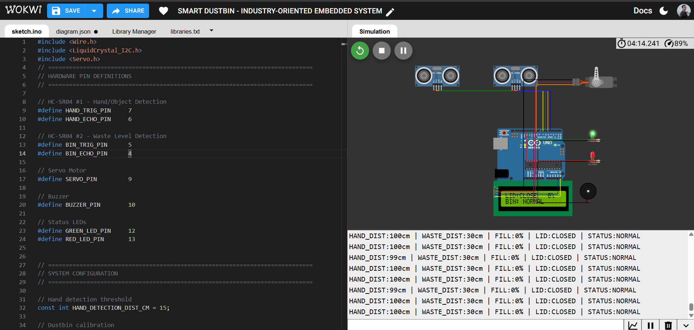
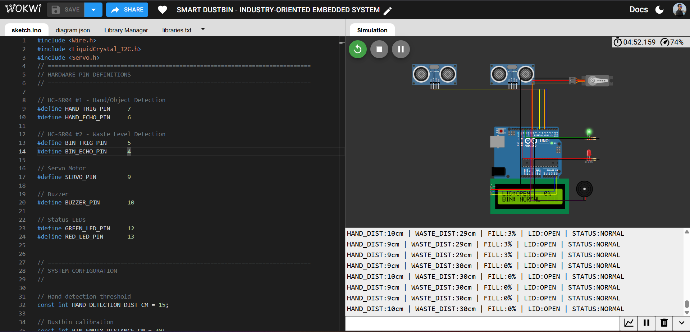
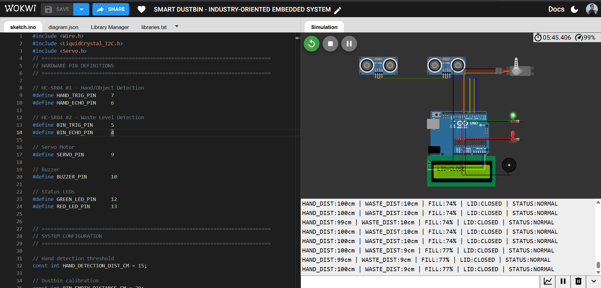
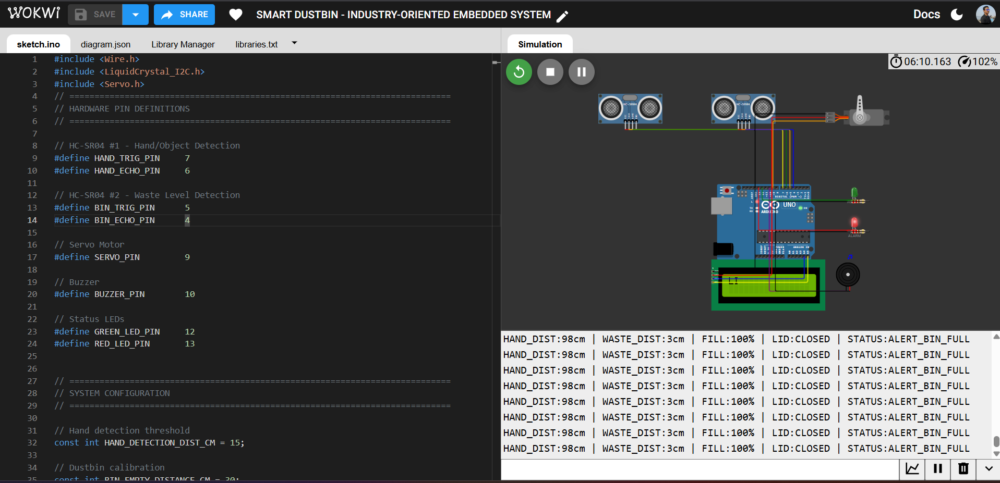

# 🗑️ Smart Dustbin – Industry-Oriented Embedded System


An Arduino-based **automatic waste bin controller** that opens its lid touch-free when a hand is detected, continuously monitors fill level with a second ultrasonic sensor, and raises a visual + audible alert once the bin crosses a configurable "full" threshold. Status is shown live on an I2C LCD and streamed over Serial for telemetry/logging.

**Live simulation:** https://wokwi.com/projects/472357743514021889

---

## 📑 Table of Contents

1. [Overview](#-overview)
2. [Problem Statement](#-problem-statement)
3. [Industry Relevance](#-industry-relevance)
4. [Features](#-features)
5. [Components Used](#-components-used)
6. [Embedded Concepts Used](#-embedded-concepts-used)
7. [Architecture](#️-architecture)
8. [Circuit Connections](#-circuit-connections)
9. [Folder Structure](#-folder-structure)
10. [Installation](#️-installation)
11. [Simulation Steps (Wokwi)](#️-simulation-steps-wokwi)
12. [How to Run](#-how-to-run)
13. [Bin-Level Formula](#-bin-level-formula)
14. [Screenshots](#-screenshots)
15. [Test Results](#-test-results)
16. [Known Limitations](#️-known-limitations)
17. [License](#-license)
18. [Future Improvements](#-future-improvements)
19. [Learning Outcomes](#-learning-outcomes)
20. [Author](#-author)

---

## 📖 Overview

Public and industrial dustbins are usually opened by hand, which spreads germs and leads to bins overflowing unnoticed until someone manually checks them. This project solves both problems with a single low-cost embedded controller built around an Arduino Uno:

- A **hand-detection ultrasonic sensor** opens the lid automatically when an object/hand comes within range, and auto-closes it after a hold period.
- A **second ultrasonic sensor** continuously measures how full the bin is and converts the distance reading into a 0–100% fill level.
- An **LCD** shows lid state and fill percentage in real time.
- **LEDs + a buzzer** escalate into a full-bin alert once the fill level crosses a set threshold, with a non-blocking blinking red LED and buzzer tone.

## 🎯 Problem Statement

Manually operated waste bins:
1. Require physical contact with the lid, spreading contamination.
2. Give no indication of fill status until they visibly overflow.
3. Rely on scheduled (rather than need-based) collection, wasting manpower and fuel.

This project addresses all three with contactless operation and real-time fill monitoring, laying the groundwork for a networked "smart city" waste-collection system.

## 🏭 Industry Relevance

This prototype demonstrates concepts directly applicable to:
- **Smart City / Municipal Solid Waste Management** – need-based collection routing instead of fixed schedules.
- **Touchless Public Infrastructure** – hygienic, contactless interaction points (elevators, dispensers, bins).
- **Industrial IoT (IIoT) monitoring** – sensor fusion, threshold-based alerting, and Serial telemetry are the same patterns used in tank-level monitoring, silo monitoring, and predictive maintenance systems.
- **Embedded Systems Engineering** – non-blocking state machines, sensor calibration, and debounced/filtered readings are core skills for firmware roles.

## ✨ Features

- 🖐️ Touchless, automatic lid opening via ultrasonic hand detection
- ⏱️ Auto-close after a configurable hold time (no lid left open indefinitely)
- 📊 Real-time bin fill percentage (0–100%) from a second ultrasonic sensor
- 🚨 Full-bin alert at a configurable threshold (default 85%)
- 🟢🔴 Status LEDs — steady green for normal, blinking red for full
- 🔊 Buzzer tone alert when the bin is full
- 🖥️ 16×2 I2C LCD live status display (lid state + fill %)
- 📡 Serial Monitor telemetry for every reading (distance, fill %, lid state, system status)
- ⚙️ Fully non-blocking `loop()` — no `delay()` calls in the main control path, so all sensors and alerts update smoothly and simultaneously

## 🔧 Components Used

| Component | Quantity | Purpose |
|---|---|---|
| Arduino Uno | 1 | Main microcontroller |
| HC-SR04 Ultrasonic Sensor | 2 | Hand detection + bin level sensing |
| SG90 Servo Motor | 1 | Lid actuation |
| 16×2 I2C LCD (PCF8574, addr `0x27`) | 1 | Status display |
| Buzzer | 1 | Audible full-bin alert |
| LED – Green | 1 | Normal status indicator |
| LED – Red | 1 | Full-bin alert indicator |
| 220 Ω Resistor | 2 | LED current limiting |
| Jumper wires / breadboard | — | Wiring |

## 🧠 Embedded Concepts Used

- **Ultrasonic ranging** — trigger/echo pulse timing with `pulseIn()` and speed-of-sound distance calculation
- **Sensor fusion** — two independent HC-SR04 units driving two separate control loops
- **Non-blocking timing** — `millis()`-based state machines for the lid auto-close, LED blink, and LCD refresh instead of `delay()`
- **State machines** — lid open/closed state persisted across loop iterations with timeout-based transitions
- **Signal conditioning** — `constrain()` and timeout handling to reject invalid/out-of-range echo readings
- **Analog-to-percentage mapping** — `map()` used to convert a physical distance range into a 0–100% fill level
- **I2C communication** — LCD driven over the two-wire I2C bus (`Wire.h`, `LiquidCrystal_I2C`)
- **PWM actuation** — servo control via the `Servo` library
- **Serial telemetry / debugging** — structured, human-readable status logging every update cycle

## 🏗️ Architecture

```
                ┌───────────────────────────┐
                │        Arduino Uno         │
                │                           │
 HC-SR04 #1 ───►│  Hand Detection (D6/D7)   │
 (Hand)         │            │              │
                │            ▼              │
                │   processAutoLid()        │──► Servo (D9) — Lid
                │            │              │
 HC-SR04 #2 ───►│  Bin Level (D4/D5)        │
 (Waste Level)  │            │              │
                │            ▼              │
                │  calculateBinLevel()      │
                │            │              │
                │            ▼              │
                │ updateAlertsAndDisplay()  │──► LCD (I2C: A4/A5)
                │            │              │──► Green LED (D12)
                │            │              │──► Red LED (D13)
                │            │              │──► Buzzer (D10)
                │            ▼              │
                │      Serial Monitor        │
                └───────────────────────────┘
```

**Control flow per loop iteration:**
1. Read hand-distance sensor → 2. Read bin-level sensor → 3. Run lid logic → 4. Recalculate fill % → 5. Every 300 ms, refresh LCD/LEDs/buzzer/Serial log.

## 🔌 Circuit Connections

| Module | Pin | Arduino Pin |
|---|---|---|
| HC-SR04 (Hand) | VCC / GND | 5V / GND |
| HC-SR04 (Hand) | TRIG | D7 |
| HC-SR04 (Hand) | ECHO | D6 |
| HC-SR04 (Bin Level) | VCC / GND | 5V / GND |
| HC-SR04 (Bin Level) | TRIG | D5 |
| HC-SR04 (Bin Level) | ECHO | D4 |
| Servo | V+ / GND | 5V / GND |
| Servo | PWM (signal) | D9 |
| Buzzer | + / − | D10 / GND |
| Green LED | Anode (via 220 Ω) | D12 |
| Red LED | Anode (via 220 Ω) | D13 |
| I2C LCD | SDA | A4 |
| I2C LCD | SCL | A5 |
| I2C LCD | VCC / GND | 5V / GND |

## 📁 Folder Structure

```
04-Smart-Dustbin-Embedded-System/
├── Output/
│   ├── 01_normal.png        # Empty bin, lid closed
│   ├── 02_lid_open.png       # Hand detected, lid open
│   ├── 03_partial_fill.png   # Bin at 74–77% fill
│   └── 04_full_alert.png     # Bin at 100%, full alert active
├── diagram.json               # Wokwi circuit/wiring definition
├── libraries.txt               # Required library list
├── sketch.ino                  # Main firmware source
└── README.md
```

## ⚙️ Installation

1. Install the [Arduino IDE](https://www.arduino.cc/en/software) (or use Wokwi directly — no install needed).
2. Install the required libraries via **Library Manager**:
   - `LiquidCrystal I2C`
   - `Servo` (bundled with Arduino IDE)
3. Wire the circuit as described in [Circuit Connections](#-circuit-connections), or open `diagram.json` directly in [Wokwi](https://wokwi.com).
4. Open `sketch.ino` in the Arduino IDE, select **Arduino Uno** as the board, and upload.

## ▶️ Simulation Steps (Wokwi)

1. Open the project: **https://wokwi.com/projects/472357743514021889**
2. Click the green ▶️ **Start Simulation** button.
3. Click on the **Hand HC-SR04** sensor's distance slider and set it below 15 cm to simulate a hand near the bin — the lid should open and the servo should rotate.
4. Click on the **Bin HC-SR04** sensor's distance slider and lower it (closer to 3 cm) to simulate waste filling up — watch the LCD fill percentage rise.
5. Push the bin-level distance to ≤ ~4.5 cm (≥ 85% fill) to trigger the full-bin alert — the red LED should blink and the buzzer should sound.
6. Watch the **Serial Monitor** panel for live telemetry of every reading.

## 🚀 How to Run

**On real hardware:**
1. Wire up the components as per the circuit table.
2. Upload `sketch.ino` via the Arduino IDE.
3. Open the Serial Monitor at **115200 baud** to view live telemetry.
4. Wave a hand near the hand-detection sensor to open the lid; it auto-closes after 3 seconds.
5. Watch the LCD and LEDs as the bin fill level changes.

**In simulation:** follow the [Simulation Steps](#️-simulation-steps-wokwi) above.

## 📐 Bin-Level Formula

The fill percentage is derived from the calibrated empty/full distances:

```
distanceRange   = BIN_EMPTY_DISTANCE_CM − BIN_FULL_DISTANCE_CM     (30 − 3 = 27 cm)
filledDistance  = BIN_EMPTY_DISTANCE_CM − wasteDistanceCm
fillPercentage  = map(filledDistance, 0, distanceRange, 0, 100)
fillPercentage  = constrain(fillPercentage, 0, 100)
```

In other words: the closer the measured echo distance is to `BIN_FULL_DISTANCE_CM` (3 cm), the higher the fill %; the closer it is to `BIN_EMPTY_DISTANCE_CM` (30 cm), the lower the fill %. Readings outside this physical range are clamped before the calculation runs, so noise or sensor glitches can't produce an invalid percentage.

| Constant | Value | Meaning |
|---|---|---|
| `BIN_EMPTY_DISTANCE_CM` | 30 cm | Sensor-to-waste distance when bin is empty |
| `BIN_FULL_DISTANCE_CM` | 3 cm | Sensor-to-waste distance when bin is full |
| `FULL_THRESHOLD_PERCENT` | 85% | Fill % at which the full-bin alert triggers |

## 📸 Screenshots

| State | Description |
|---|---|
|  | **Normal** — bin empty (0% fill), lid closed, green LED on |
|  | **Lid Open** — hand detected (9–10 cm), servo rotates lid open |
|  | **Partial Fill** — bin at ~74–77% fill, still within normal range |
|  | **Full Alert** — bin at 100% fill, red LED blinking, buzzer active, `STATUS:ALERT_BIN_FULL` on Serial |

## ✅ Test Results

| Test Case | Input Condition | Expected Behaviour | Result |
|---|---|---|---|
| Idle / empty bin | Hand ≥ 15 cm, Waste = 30 cm | Lid closed, 0% fill, green LED on | ✅ Pass |
| Hand detected | Hand ≤ 15 cm | Lid opens (servo → 90°), stays open while hand present | ✅ Pass |
| Lid auto-close | Hand removed, 3 s elapsed | Lid closes (servo → 0°) automatically | ✅ Pass |
| Partial fill | Waste distance ≈ 9–10 cm | Fill % ≈ 74–77%, still `STATUS:NORMAL` | ✅ Pass |
| Full bin | Waste distance ≈ 3 cm | Fill = 100%, red LED blinks, buzzer tone, `STATUS:ALERT_BIN_FULL` | ✅ Pass |
| Out-of-range echo | No echo / timeout | Reading clamped/defaulted, no crash or invalid % | ✅ Pass |
| Concurrent operation | Hand + full bin simultaneously | Lid logic and alert logic run independently without blocking each other | ✅ Pass |

*(Results captured from Wokwi simulation runs; see `Output/` screenshots for corresponding Serial telemetry.)*

## ⚠️ Known Limitations

- **Single-point sensing**: the bin-level ultrasonic sensor takes one distance reading down the center of the bin, so unevenly piled or soft/absorbent waste (paper, fabric) can be under- or over-estimated compared to true volume.
- **No weight awareness**: the system measures fill *height*, not mass — a bin full of light crumpled paper reads the same as one full of dense compacted waste.
- **Ultrasonic blind zone**: HC-SR04 sensors have a minimum reliable sensing distance (~2 cm); waste piled higher than the `BIN_FULL_DISTANCE_CM` calibration point may not be distinguished further.
- **No persistent storage**: fill history and alert logs are not saved anywhere — data only exists on the Serial Monitor for the current session.
- **Single-bin scope**: the current design monitors one bin locally; it isn't yet networked for fleet-wide municipal monitoring (see Future Improvements).
- **Environmental sensitivity**: ultrasonic readings can be affected by dust, moisture, or reflective surfaces inside real-world bins, more so than in simulation.

## 📄 License

This project is licensed under the **MIT License** — free to use, modify, and distribute for personal, academic, or commercial purposes, with attribution appreciated.

## 🔮 Future Improvements

- Add a **cloud/IoT layer** (ESP32 + MQTT or HTTP) to push fill-level data to a dashboard for route optimization.
- Replace fixed calibration constants with an **auto-calibration routine** run at first boot.
- Add a **battery + solar charging** circuit for outdoor deployment.
- Introduce a **weight sensor** alongside ultrasonic ranging for more accurate fill estimation (accounts for compressible waste).
- Add **RFID/GSM-based bin identification** for municipal fleet tracking.
- Implement **debounce/median filtering** on ultrasonic readings to further reduce noise.
- Add a **low-power sleep mode** between readings for battery-powered deployments.

## 🎓 Learning Outcomes

- Practical experience interfacing multiple ultrasonic sensors on a single microcontroller
- Designing **non-blocking, multi-tasking firmware** using `millis()` instead of `delay()`
- Sensor calibration and mapping physical measurements to meaningful application-level values
- Driving I2C peripherals (LCD) alongside PWM (servo) and digital I/O (LEDs, buzzer) concurrently
- Building and testing embedded systems entirely in simulation (Wokwi) before physical deployment
- Structuring firmware with clear separation of concerns (sensing, control logic, alerting/display)

## 👤 Author

**Subham Bhattacherjee**
**GitHub:** [View Repository](https://github.com/Subhamrbj/Embedded-Systems-Projects/tree/main/04-Smart-Dustbin-Embedded-System)
**Simulation:** https://wokwi.com/projects/472357743514021889
