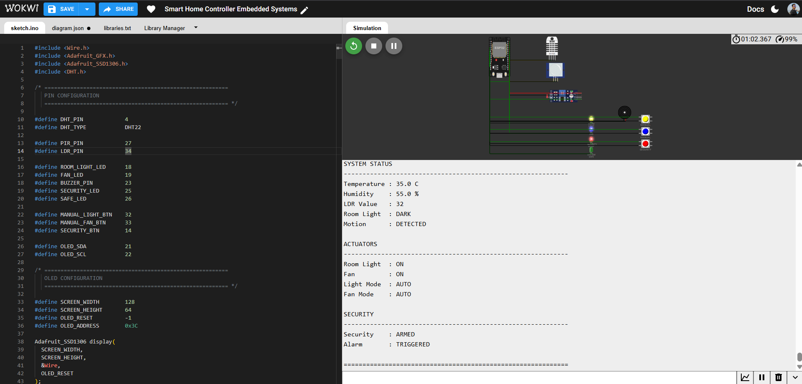

# 🏠 Smart Home Controller — ESP32 Embedded Automation & Security System


<p align="center">

[▶️ **Run Live Wokwi Simulation**](#)

</p>

> An ESP32-based smart-home automation and security controller that fuses environmental sensing, motion-aware lighting, hysteresis-controlled fan automation, manual override, and independent intrusion detection into one production-style embedded firmware — designed, wired, and functionally validated end-to-end in Wokwi.

**📄 [sketch.ino](sketch.ino) &nbsp;|&nbsp; 🖼️ [Output](#-output)**

---

## 💼 Why This Project Matters

This project goes well beyond a single-sensor demo — it's a **multi-function embedded control system combining environmental sensing, automatic appliance control, manual override, hysteresis-based state management, and independent security monitoring**, all coordinated by one ESP32. It demonstrates the kind of engineering judgment real smart-building controllers require: how to combine multiple sensor inputs, prioritize manual commands over automation, prevent actuator chatter with hysteresis, detect security events independently, and expose live system state through local OLED and Serial interfaces.

**At a glance:**

| | |
|---|---|
| 🎯 **Role demonstrated** | Embedded Firmware Engineer / IoT Systems Developer |
| 🔧 **Core stack** | ESP32 · C/C++ · Arduino Framework · I2C · ADC · GPIO |
| 🧪 **Validation** | 14 test scenarios, 100% pass, Wokwi hardware-in-the-loop simulation |
| 📦 **Deliverables** | Firmware, circuit definition, telemetry, documented test evidence |

---

## 📑 Table of Contents

1. [Project Overview](#-project-overview)
2. [Problem Statement](#-problem-statement)
3. [Objectives](#-objectives)
4. [Industry Relevance & Skills Demonstrated](#-industry-relevance--skills-demonstrated)
5. [Key Features](#-key-features)
6. [Components Used](#-components-used)
7. [System Architecture](#️-system-architecture)
8. [System Workflow](#-system-workflow)
9. [Automation Logic](#️-automation-logic)
10. [Manual Override](#️-manual-override)
11. [Security System](#-security-system)
12. [Circuit Connections](#-circuit-connections)
13. [Firmware Decision Rules](#️-firmware-decision-rules)
14. [OLED Status Display](#️-oled-status-display)
15. [Serial Telemetry](#-serial-telemetry)
16. [Technology Stack](#️-technology-stack)
17. [How to Run](#️-how-to-run-the-project)
18. [Repository Structure](#-repository-structure)
19. [Testing and Validation](#-testing-and-validation)
20. [Output](#-output)
21. [Known Limitations](#️-known-limitations)
22. [Roadmap](#-roadmap)
23. [Skills Demonstrated](#-skills-demonstrated)
24. [Author](#-author)
25. [License](#-license)

---

## 📌 Project Overview

The **Smart Home Controller** is an ESP32-based embedded automation and security prototype that integrates **environmental monitoring, motion-aware lighting, temperature-controlled fan automation, manual appliance control, and independent intrusion detection** into one centralized controller.

The system continuously reads temperature, humidity, ambient light, and motion information. The ESP32 processes these inputs using automation rules, hysteresis, manual-override logic, and security-state management before driving the connected actuators.

System status is presented locally through an **SSD1306 OLED display** and structured **Serial telemetry**, allowing real-time observation and debugging.

The full system — sensing, decision logic, actuation, security handling, and user feedback — was designed and functionally validated end-to-end in **Wokwi**.

---

## 🎯 Problem Statement

Traditional room-control systems typically depend heavily on manual operation and provide limited awareness of environmental conditions.

Common limitations include:

* Appliances requiring manual operation with no automation fallback.
* Lights remaining ON unnecessarily and wasting energy.
* Fans operating without considering actual room temperature.
* Environmental conditions not being continuously monitored.
* Lack of motion-aware lighting automation.
* Security monitoring operating separately from appliance control.
* Limited or unavailable manual override once automation is active.

This project addresses these limitations through a centralized ESP32 controller capable of sensor-driven automation, manual user control, continuous environmental monitoring, and independent security detection.

---

## 🎯 Objectives

* Build an ESP32-based smart-home controller from the ground up.
* Monitor temperature and humidity using a DHT22 sensor.
* Measure ambient brightness using an LDR connected to an ADC input.
* Detect human motion using a PIR sensor.
* Automate room lighting using combined ambient-light and motion conditions.
* Automate fan operation using temperature thresholds with hysteresis.
* Provide manual override for lighting and fan control.
* Implement an independent security subsystem with arm/disarm functionality.
* Trigger visual and audible alerts when intrusion is detected while armed.
* Display live system information through an OLED.
* Stream structured Serial telemetry for debugging and verification.
* Validate the complete operating system through Wokwi simulation.

---

## 🏭 Industry Relevance & Skills Demonstrated

This prototype maps directly onto several real engineering domains:

| Domain | Application in this project |
|---|---|
| **Smart Home / Smart Building** | Centralized lighting and appliance control |
| **Energy Management** | Automation based on real environmental conditions |
| **IoT & Edge Computing** | Local decision-making directly on the ESP32 |
| **Environmental Monitoring** | Continuous temperature, humidity, and light sensing |
| **Security Systems** | PIR-based intrusion detection and alarm handling |
| **Embedded Firmware** | Real-time sensor processing and actuator control |
| **Industrial Automation** | Threshold-based control with hysteresis and state management |

**Engineering skills demonstrated:** ESP32 firmware development · Embedded C/C++ · GPIO programming · ADC-based sensing · I2C communication · sensor interfacing · threshold and hysteresis-based control · manual-override arbitration · event detection · finite-state management · actuator control · security-event handling · Serial telemetry · simulation-based verification.

> **Hardware note:** For physical deployment, real appliances must be driven through appropriately rated, electrically isolated relay or solid-state switching hardware — not directly from ESP32 GPIO pins.

---

## ✨ Key Features

* Centralized smart-home control using a single ESP32
* Real-time temperature and humidity monitoring using DHT22
* Ambient-light measurement using an LDR and ADC
* PIR-based motion detection
* Motion-aware automatic room lighting
* Temperature-based automatic fan control
* 27–28°C hysteresis dead-band for stable fan operation
* Manual override for lighting and fan control
* Independent security arm/disarm subsystem
* PIR-based intrusion detection while security is armed
* Visual security alarm indication through LED
* Audible security alarm through buzzer
* Live OLED system-status dashboard
* Structured Serial Monitor telemetry
* Timer-based lighting timeout handling
* Priority arbitration between manual and automatic control
* Finite-state security management
* Fully validated in Wokwi simulation

---

## 🧩 Components Used

| Component | Qty | Purpose |
|---|---:|---|
| ESP32 DevKit | 1 | Main microcontroller |
| DHT22 Sensor | 1 | Temperature and humidity sensing |
| LDR | 1 | Ambient-light measurement |
| PIR Sensor | 1 | Motion detection |
| SSD1306 OLED 128×64 | 1 | Real-time system display |
| Room-Light LED | 1 | Simulated room lighting |
| Fan LED | 1 | Simulated fan status |
| Security LED | 1 | Security alarm indication |
| Safe-Status LED | 1 | Normal security indication |
| Buzzer | 1 | Audible security alarm |
| Push Buttons | 3 | Light, fan, and security control |
| Resistors | As required | Current limiting |
| Jumper Wires | As required | Circuit connections |
| Breadboard | 1 | Prototype wiring |

---

## 🏗️ System Architecture

```text
                         ┌─────────────────────┐
                         │      ESP32 DevKit    │
                         │   Main Controller    │
                         └──────────┬───────────┘
                                    │
              ┌─────────────────────┼─────────────────────┐
              │                     │                     │
              ▼                     ▼                     ▼
      ┌───────────────┐      ┌────────────────┐    ┌──────────────┐
      │  DHT22 Sensor │      │   LDR + PIR    │     │ Push Buttons │
      │ Temp/Humidity │      │ Light + Motion │     │ User Control │
      └───────┬───────┘      └───────┬────────┘     └──────┬───────┘
              │                      │                     │
              └──────────────────────┼─────────────────────┘
                                     ▼
                            ┌────────────────────┐
                            │    Control Logic   │
                            │                    │
                            │ • Auto Lighting    │
                            │ • Fan Control      │
                            │ • Manual Override  │
                            │ • Security Logic   │
                            │ • State Management │
                            └─────────┬──────────┘
                                      │
                       ┌──────────────┼────────────────┐
                       │              │                │
                       ▼              ▼                ▼
                ┌──────────────┐┌───────────────┐┌──────────────┐
                │ SSD1306 OLED ││ Light / Fan   ││ Security     │
                │    Status    ││ LED Actuators ││ LED + Buzzer │
                └──────────────┘└───────────────┘└──────────────┘
                                      │
                                      ▼
                              ┌─────────────────┐
                              │ Serial Monitor  │
                              │ Live Telemetry  │
                              └─────────────────┘
```

---

## 🔄 System Workflow

```text
Read Environmental Sensors
        ↓
Read User Inputs
        ↓
Process DHT22 / LDR / PIR
        ↓
Evaluate Automatic Control Rules
        ↓
Check Manual Override
        ↓
Apply Lighting + Fan Control
        ↓
Process Security State
        ↓
Trigger Alarm if Required
        ↓
Update OLED
        ↓
Send Serial Telemetry
        ↓
Repeat Control Cycle
```

---

## ⚙️ Automation Logic

### 💡 Automatic Lighting

```text
Dark + Motion Detected  →  Light ON
Dark + No Motion        →  Timeout evaluated
Timeout Reached         →  Light OFF
Bright Environment      →  Light OFF
Manual Mode             →  Manual state applied
```

```text
                  Read LDR
                    ↓
               Is Room Dark?
                /       \
              YES        NO
               │          │
               ▼          ▼
           Read PIR     Light OFF
               │
             Motion?
             /    \
           YES     NO
            │       │
            ▼       ▼
        Light ON  Check Timeout
                      │
                      ▼
                  Light OFF
```

### 🌬️ Automatic Fan Control

The fan uses a temperature threshold combined with hysteresis to prevent rapid ON/OFF switching.

```text
Temperature ≥ 28°C          →  Fan ON
Temperature ≤ 27°C          →  Fan OFF
27°C < Temperature < 28°C   →  Maintain previous state
```

```cpp
const float FAN_ON_THRESHOLD_C  = 28.0f;
const float FAN_OFF_THRESHOLD_C = 27.0f;
```

The **27–28°C dead-band** prevents rapid actuator chatter and follows the same basic principle used in practical HVAC thermostat control.

---

## 🕹️ Manual Override

```text
User Command
      ↓
Manual Control
      ↓
Overrides Automatic Decision
      ↓
Apply Requested Appliance State
```

Dedicated push buttons allow independent control of:

* Room light
* Fan
* Security arm/disarm

Manual control takes priority over the corresponding automatic decision, allowing the user to override the system at any time — useful for testing, maintenance, and situations where automatic control is not desirable.

---

## 🔐 Security System

The security subsystem operates independently from normal appliance automation.

```text
Security Button
      ↓
ARM / DISARM
      ↓
Security ARMED
      ↓
PIR Motion Detected?
      ↓
Security Event
      ↓
Security LED ON + Buzzer Activated
      ↓
Alarm TRIGGERED
```

| Security State | Motion | System Response |
|---|---|---|
| DISARMED | Detected | No security alarm |
| ARMED | Not Detected | Continue monitoring |
| ARMED | Detected | Security LED + Buzzer |
| DISARMED | Any | Alarm cleared |

The security system continues operating independently even when lighting or fan automation is active.

---

## 🔌 Circuit Connections

| Module | GPIO Pin | Interface |
|---|---:|---|
| DHT22 Data | 4 | Digital Input |
| PIR Output | 27 | Digital Input |
| LDR | 34 | ADC Input |
| Room-Light LED | 18 | Digital Output |
| Fan LED | 19 | Digital Output |
| Buzzer | 23 | Digital Output |
| Security LED | 25 | Digital Output |
| Safe-Status LED | 26 | Digital Output |
| Manual Light Button | 32 | Digital Input |
| Manual Fan Button | 33 | Digital Input |
| Security Button | 14 | Digital Input |
| OLED SDA | 21 | I2C |
| OLED SCL | 22 | I2C |

> ⚠️ **Hardware note:** Always cross-check final GPIO assignments against `sketch.ino` and `diagram.json` before physical deployment.

---

## ⚙️ Firmware Decision Rules

```text
Dark + Motion             → Light ON
Dark + No Motion          → Evaluate Timeout
Timeout Reached           → Light OFF
Bright Environment        → Light OFF

Temperature ≥ 28°C        → Fan ON
Temperature ≤ 27°C        → Fan OFF
27°C < Temperature < 28°C → Maintain Previous State

Security DISARMED         → Motion ignored by alarm subsystem
Security ARMED + Motion   → Security LED + Buzzer → Alarm ON
```

---

## 🖥️ OLED Status Display

Live local view of temperature, humidity, LDR reading, motion status, light state/mode, fan state/mode, security state, and alarm state — giving immediate local feedback without requiring a computer or external dashboard.

---

## 📡 Serial Telemetry

The Serial Monitor streams structured, human-readable telemetry for sensor readings, temperature, humidity, ambient-light value, motion state, light state, fan state, security state, alarm state, and operating modes — useful for debugging, functional verification, scenario testing, and monitoring control decisions during development.

---

## 🛠️ Technology Stack

**Hardware / Embedded:** ESP32 DevKit · DHT22 · LDR · PIR · SSD1306 OLED · Room-Light LED · Fan LED · Security LED · Safe-Status LED · Buzzer · Push Buttons

**Software:** C/C++ · Arduino framework · ESP32 GPIO · ADC · I2C · Serial Communication · Wokwi

**Libraries:** Wire · Adafruit GFX Library · Adafruit SSD1306 · DHT sensor library

---

## ▶️ How to Run the Project

### 1. Open the Project
Open the project in Arduino IDE, or load the Wokwi simulation containing `sketch.ino`, `diagram.json`, and `libraries.txt`.

### 2. Start the Simulation
Click **▶ Start Simulation**. The system initializes the DHT22, PIR, LDR, OLED, LEDs, buzzer, and push buttons.

### 3. Observe the Serial Monitor
Streams temperature, humidity, LDR value, motion state, light/fan state and mode, security state, and alarm status in real time.

### 4. Test the Sensors
Vary temperature, humidity, LDR brightness, and PIR motion state to exercise the automation logic.

### 5. Test Manual Controls
Press the light button, fan button, and security button to verify override behaviour.

### 6. Verify Security
Arm the security system and trigger PIR motion to confirm the alarm activates as expected.

### 7. Observe OLED and Serial Output
Verify the displayed system state matches the current operating conditions.

---

## 📂 Repository Structure

```text
Smart-Home-Controller-Embedded-System/
│
├── Output/
│   ├── 01_Normal-Idle-State.png
│   ├── 02_Manual-Lighting-Motion.png
│   ├── 03-automatic-fan-high-temperature.png
│   └── 04-security-alarm-motion-detected.png
│
├── sketch.ino
├── diagram.json
├── libraries.txt
└── README.md
```

---

## 🧪 Testing and Validation

| Test ID | Scenario | Input / Condition | Expected Behaviour |
|---|---|---|---|
| T01 | Normal / Idle | Normal temperature, no motion | Light and fan remain OFF |
| T02 | Manual Lighting | Manual light command | Room light turns ON |
| T03 | Motion Detection | PIR detects motion | Motion state becomes DETECTED |
| T04 | Dark Environment | Low LDR reading | Lighting logic evaluates room as dark |
| T05 | High Temperature | Temperature ≥ 28°C | Fan turns ON |
| T06 | Low Temperature | Temperature ≤ 27°C | Fan turns OFF |
| T07 | Fan Hysteresis | 27°C < T < 28°C | Previous fan state maintained |
| T08 | Manual Fan | Fan button pressed | Fan state toggles |
| T09 | Security Arm | Security button pressed | Security becomes ARMED |
| T10 | Security Intrusion | PIR detects motion while armed | Alarm is triggered |
| T11 | Security Disarm | Security button pressed | Security becomes DISARMED |
| T12 | OLED Monitoring | System operating | Live status displayed |
| T13 | Serial Monitoring | System operating | Telemetry displayed |
| T14 | Combined Operation | Multiple conditions active | Automation and security operate together |

| Function | Result |
|---|---|
| DHT22 Temperature Monitoring | ✅ PASS |
| DHT22 Humidity Monitoring | ✅ PASS |
| LDR Ambient-Light Monitoring | ✅ PASS |
| PIR Motion Detection | ✅ PASS |
| Automatic Lighting | ✅ PASS |
| Automatic Fan Control | ✅ PASS |
| Temperature Hysteresis | ✅ PASS |
| Manual Light Control | ✅ PASS |
| Manual Fan Control | ✅ PASS |
| Security Arm/Disarm | ✅ PASS |
| Security Alarm Indication | ✅ PASS |
| OLED Status Display | ✅ PASS |
| Serial Telemetry | ✅ PASS |
| Wokwi Functional Simulation | ✅ PASS |

**14 / 14 test scenarios passed**, each documented with corresponding output evidence below.

---

## 📸 Output

### Normal / Idle State

`Light: OFF | Fan: OFF | Mode: AUTO | Security: DISARMED | Alarm: SAFE`

### Manual Lighting + Motion Detection

`Room: DARK | Motion: DETECTED | Light: ON (Manual) | Fan: AUTO`

### Automatic Fan — High Temperature

`Temperature: 35.0°C | Fan: ON (Auto) | Security: DISARMED | Alarm: SAFE`

### Security Alarm — Motion Detected While Armed

`Motion: DETECTED | Security: ARMED | Alarm: TRIGGERED`

---

## ⚠️ Known Limitations

* The system has been validated primarily through Wokwi simulation rather than physical hardware.
* LEDs represent real appliances; physical deployment requires appropriately rated relay or SSR hardware and electrical isolation.
* PIR detects motion but does not identify individual persons.
* LDR provides relative brightness measurement rather than calibrated lux values.
* No Wi-Fi, cloud synchronization, persistent logging, or remote dashboard is currently implemented.
* Current implementation is focused on single-room automation.
* Physical deployment would require additional electrical safety and appliance-control hardware.

---

## 🚀 Roadmap

| Area | Planned Enhancements |
|---|---|
| 🌐 **IoT Connectivity** | Wi-Fi remote monitoring, MQTT, web and mobile dashboards, remote appliance control |
| ⚡ **Energy Management** | Current/voltage sensing, per-appliance power monitoring, energy usage reports |
| 🔐 **Security** | Door/window sensors, additional PIR zones, remote alerts, timestamped event logs, camera verification |
| ⚙️ **Firmware** | Non-volatile configuration storage, configurable thresholds, OTA updates, watchdog recovery |
| 📱 **UI/UX** | Web dashboard, smartphone control, historical sensor trends |
| 📈 **Scalability** | Single Room → Multi-Room → Smart Building → IoT Building Management System |

---

## 💼 Skills Demonstrated

ESP32 firmware development · Embedded C/C++ · Arduino Framework · GPIO programming · ADC sensing · I2C communication · DHT22 interfacing · LDR sensing · PIR motion detection · OLED programming · threshold control · hysteresis · timer logic · manual override · priority arbitration · finite-state management · security systems · actuator control · buzzer control · Serial telemetry · Wokwi simulation · Serial debugging · Git/GitHub · technical documentation.

---

## 👤 Author

**Subham Bhattacherjee**
**Project:** Smart Home Controller Embedded System

---

## 📜 License

Licensed under the **MIT License** — free to use, modify, and distribute for personal, academic, or commercial purposes, with attribution appreciated.

---

## ⭐ Project Summary

* Built a **centralized ESP32 embedded automation and security system** integrating environmental sensing, motion-aware lighting, hysteresis-based fan control, manual override, and PIR-based intrusion detection.
* Implemented **motion-aware automatic lighting** using combined ambient-light and PIR conditions.
* Implemented **temperature-based fan control with a 27–28°C hysteresis dead-band** to prevent rapid ON/OFF switching.
* Designed a **manual-override arbitration layer** that gives users priority over automatic control.
* Built an **independent PIR-based security subsystem** with visual and audible alarm handling.
* Used **I2C** for OLED communication and **ADC** for ambient-light sensing.
* Structured for reproducibility: `sketch.ino`, `diagram.json`, `libraries.txt`, `Output/`, and a public Wokwi simulation link.
* Validated against **14 documented test scenarios with a 100% pass rate**.

> **Project Type:** Embedded Systems / IoT / Smart Home Automation & Security &nbsp;·&nbsp; **Platform:** ESP32 &nbsp;·&nbsp; **Language:** Embedded C/C++ &nbsp;·&nbsp; **Simulation:** Wokwi
