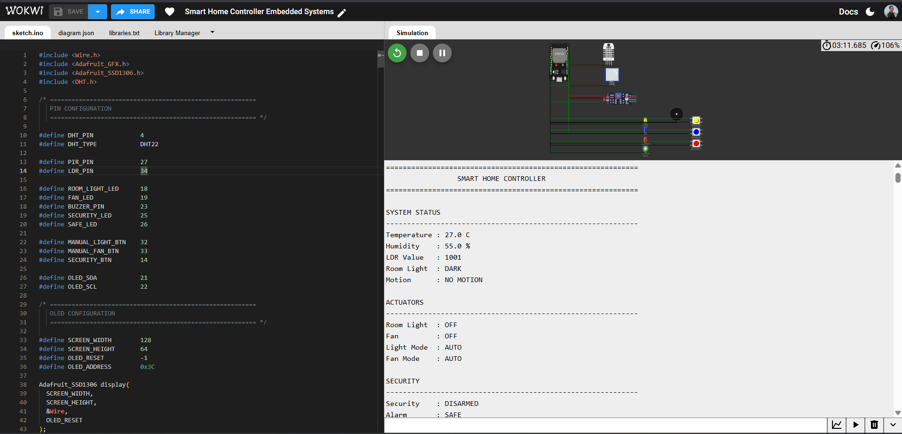
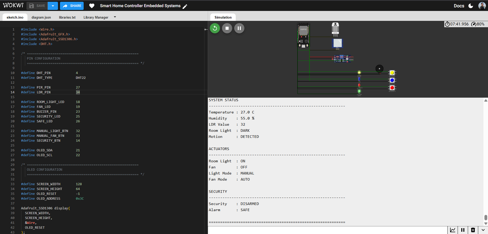

# 🏠 Smart Home Controller — ESP32 Embedded Automation & Security System


> An ESP32-based smart-home automation and security controller that fuses environmental sensing, motion-aware lighting, hysteresis-controlled fan automation, manual override, and independent intrusion detection into one production-style embedded firmware — designed, wired, and functionally validated end-to-end in Wokwi.

**🔗 [View Live Simulation on Wokwi](#) &nbsp;|&nbsp; 📄 [sketch.ino](#) &nbsp;|&nbsp; 🖼️ [Screenshots](#-screenshots)**

---

## 💼 Why This Project Matters

This isn't a blinking-LED demo — it's a systems-level firmware project that mirrors how real smart-building controllers are built: multiple sensors feeding a shared decision engine, competing control priorities (auto vs. manual), stateful hysteresis to prevent actuator chatter, and a security subsystem that runs independently of — but coordinates with — everyday automation. It demonstrates the full firmware lifecycle: requirements → architecture → GPIO/I2C/ADC interfacing → control-logic implementation → simulation-based verification → documentation.

**At a glance:**

| | |
|---|---|
| 🎯 **Role demonstrated** | Embedded Firmware Engineer / IoT Systems Developer |
| 🔧 **Core stack** | ESP32 · C/C++ · Arduino Framework · I2C · ADC · GPIO |
| 🧪 **Validation** | 14 test scenarios, 100% pass, Wokwi hardware-in-the-loop simulation |
| 📦 **Deliverables** | Firmware, circuit definition, telemetry, documented test evidence |

---

## 📑 Table of Contents

1. [Overview](#-overview)
2. [Problem Statement](#-problem-statement)
3. [Objectives](#-objectives)
4. [Industry Relevance & Skills Demonstrated](#-industry-relevance--skills-demonstrated)
5. [Features](#-features)
6. [Components Used](#-components-used)
7. [Technologies Used](#️-technologies-used)
8. [Embedded Concepts Applied](#-embedded-concepts-applied)
9. [System Architecture](#️-system-architecture)
10. [Circuit Connections](#-circuit-connections)
11. [Automation Logic](#️-automation-logic)
12. [Manual Override](#️-manual-override)
13. [Security System](#-security-system)
14. [Folder Structure](#-folder-structure)
15. [Installation](#️-installation)
16. [How to Run](#️-how-to-run)
17. [Wokwi Simulation](#️-wokwi-simulation)
18. [Test Scenarios](#-test-scenarios)
19. [Screenshots](#-screenshots)
20. [Test Results](#-test-results)
21. [Known Limitations](#️-known-limitations)
22. [Roadmap](#-roadmap)
23. [Learning Outcomes](#-learning-outcomes)
24. [Author](#-author)
25. [License](#-license)

---

## 📖 Overview

Traditional room-control setups rely on manual switching and have little to no awareness of the environment they operate in — leading to wasted energy, reduced convenience, and no meaningful integration between comfort systems and security.

This project solves that with a **centralized ESP32 controller** that unifies:

* 🌡️ Temperature & 💧 humidity monitoring (DHT22)
* 💡 Automatic, motion-aware room lighting
* 🌬️ Temperature-driven fan control with hysteresis
* 🕹️ Manual override for every actuator
* 🌙 Ambient-light sensing (LDR)
* 🚶 Motion detection (PIR)
* 🔐 Independent arm/disarm security subsystem
* 🚨 Visual + audible alarm indication
* 🖥️ Real-time OLED status dashboard
* 📡 Structured Serial telemetry for debugging and verification

The firmware continuously reads sensors, evaluates control rules, drives actuators, manages security state, and reports live system status via OLED and Serial — the same control loop pattern used in commercial building-automation controllers.

---

## 🎯 Problem Statement

Conventional room-control systems typically fall short in several ways:

1. Appliances require manual operation with no automation fallback.
2. Lights stay on unnecessarily, wasting energy.
3. Fans run without regard to actual room temperature.
4. Environmental conditions aren't continuously monitored.
5. Motion-based automation is often unavailable.
6. Security monitoring is bolted on separately from appliance control.
7. Manual override isn't available once automation takes over.

This project directly addresses each of these with a single embedded controller capable of **sensor-driven automation, user override, continuous environmental monitoring, and independent security detection**.

---

## 🎯 Objectives

* Build an ESP32-based smart-home controller from the ground up.
* Monitor temperature and humidity via DHT22.
* Measure ambient brightness via LDR (ADC).
* Detect human presence via PIR.
* Automate room lighting from combined light + motion state.
* Automate fan control using a temperature threshold with hysteresis.
* Provide manual override for lighting and fan control.
* Implement a fully independent security subsystem (arm/disarm, alarm).
* Trigger visual + audible alerts on intrusion while armed.
* Present live system state on an OLED display.
* Stream structured Serial telemetry for debugging and verification.
* Validate every operating mode through Wokwi simulation.

---

## 🏭 Industry Relevance & Skills Demonstrated

This prototype maps directly onto real engineering domains:

| Domain | Application in this project |
|---|---|
| **Smart Home / Smart Building** | Centralized lighting + appliance control |
| **Energy Management** | Automation driven by real sensor conditions, not fixed timers |
| **IoT & Edge Computing** | All decision-making runs locally on the ESP32 |
| **Environmental Monitoring** | Continuous temperature, humidity, and light sensing |
| **Security Systems** | PIR-based intrusion detection with alarm handling |
| **Embedded Firmware** | Real-time sensor fusion and actuator control |
| **Industrial Automation** | Threshold-based control with hysteresis and state management |

**Engineering skills demonstrated:** ESP32 firmware development · Embedded C/C++ · GPIO programming · ADC-based sensing · I2C communication · sensor interfacing · threshold & hysteresis-based control · manual-override arbitration · event detection · finite-state management · actuator control · security-event handling · Serial telemetry · simulation-based verification.

> **Hardware note:** For physical deployment, real appliances must be driven through appropriately rated, electrically isolated relay or solid-state switching hardware — not directly from GPIO.

---

## ✨ Features

### 🌡️ Environmental Monitoring
Temperature and humidity via DHT22, ambient light via LDR, motion via PIR — all fused into a single, continuously updated system state visible on OLED and Serial.

### 💡 Automatic Lighting

```text
                 Read LDR
                    ↓
              Is Room Dark?
                /       \
              YES        NO
               │          │
               ▼          ▼
           Read PIR     Light OFF
               │
            Motion?
            /    \
          YES     NO
           │       │
           ▼       ▼
       Light ON  Check Timeout
                    │
                    ▼
                Light OFF
```

| Condition | Result |
|---|---|
| Dark + Motion Detected | Light ON |
| Dark + No Motion | Timeout evaluated |
| Timeout Reached | Light OFF |
| Bright Environment | Light OFF |
| Manual Mode | Manual state applied |

### 🌬️ Automatic Fan Control (with Hysteresis)

```text
              Read Temperature
                     ↓
            Temperature ≥ 28°C?
              /          \
            YES           NO
             │             │
             ▼             ▼
          FAN ON      Temperature ≤ 27°C?
                           /       \
                         YES        NO
                          │          │
                          ▼          ▼
                       FAN OFF   Keep Previous
                                  Fan State
```

| Temperature | Fan Action |
|---|---|
| ≥ 28°C | ON |
| ≤ 27°C | OFF |
| 27°C < T < 28°C | Maintain previous state |

The 27–28°C dead-band prevents rapid ON/OFF chatter — the same technique used in real HVAC thermostats.

### 🕹️ Manual Appliance Control
Dedicated push buttons for light, fan, and security let the user override automatic decisions at any time — critical for testing, maintenance, and edge-case handling.

### 🔐 Security Monitoring
Runs independently of appliance automation. Once armed, any PIR motion event immediately triggers the alarm — visual (LED) and audible (buzzer) — regardless of the current lighting/fan state.

### 🖥️ OLED Status Display
Live view of temperature, humidity, LDR reading, motion state, light/fan state and mode, security state, and alarm state — refreshed every cycle.

### 📡 Serial Telemetry
Structured, human-readable output for debugging, automation verification, and functional testing during development.

---

## 🔧 Components Used

| Component | Qty | Purpose |
|---|---:|---|
| ESP32 DevKit | 1 | Main microcontroller |
| DHT22 Sensor | 1 | Temperature and humidity sensing |
| LDR | 1 | Ambient-light measurement |
| PIR Sensor | 1 | Motion detection |
| SSD1306 OLED 128×64 | 1 | Real-time status display |
| Room-Light LED | 1 | Simulated room lighting |
| Fan LED | 1 | Simulated fan status |
| Security LED | 1 | Security alarm indication |
| Safe-Status LED | 1 | Normal security indication |
| Buzzer | 1 | Audible security alarm |
| Push Buttons | 3 | Light, fan, and security control |
| Resistors | As required | Current limiting |
| Jumper Wires | As required | Circuit connections |
| Breadboard | 1 | Prototype wiring |

---

## 🛠️ Technologies Used

| Technology | Application |
|---|---|
| ESP32 | Main embedded controller |
| Embedded C/C++ | Firmware development |
| Arduino Framework | Firmware development |
| DHT22 | Temperature and humidity sensing |
| LDR | Ambient-light sensing |
| PIR | Motion detection |
| SSD1306 OLED | System status interface |
| I2C | OLED communication |
| GPIO | Digital input/output |
| ADC | LDR measurement |
| Wokwi | Virtual circuit simulation |
| Serial Monitor | Debugging and telemetry |

---

## 🧠 Embedded Concepts Applied

`GPIO Programming` · `ADC Sensing` · `I2C Communication` · `Digital Input/Output` · `Threshold Control` · `Hysteresis` · `Timer Logic` · `Finite-State Management` · `Event Detection` · `Priority Arbitration (Manual > Auto)` · `Serial Communication` · `Sensor Interfacing` · `Simulation-Based Testing`

---

## 🏗️ System Architecture

```text
                         ┌───────────────────────┐
                         │      ESP32 DevKit     │
                         │    Main Controller    │
                         └───────────┬───────────┘
                                     │
              ┌──────────────────────┼──────────────────────┐
              │                      │                      │
              ▼                      ▼                      ▼
       ┌──────────────┐      ┌────────────────┐      ┌──────────────┐
       │ DHT22 Sensor │      │   LDR + PIR    │      │ Push Buttons │
       │ Temp/Humidity│      │ Light + Motion │      │ User Control │
       └──────┬───────┘      └───────┬────────┘      └──────┬───────┘
              │                      │                      │
              └──────────────────────┼──────────────────────┘
                                     ▼
                            ┌────────────────────┐
                            │    Control Logic   │
                            │                    │
                            │ • Auto Lighting    │
                            │ • Fan Control      │
                            │ • Manual Override  │
                            │ • Security Logic   │
                            │ • State Management │
                            └─────────┬──────────┘
                                      │
                      ┌───────────────┼────────────────┐
                      │               │                │
                      ▼               ▼                ▼
               ┌──────────────┐ ┌───────────────┐ ┌──────────────┐
               │ SSD1306 OLED │ │ Light / Fan   │ │ Security     │
               │ Status       │ │ LED Actuators │ │ LED + Buzzer │
               └──────────────┘ └───────────────┘ └──────────────┘
                                      │
                                      ▼
                               ┌─────────────────┐
                               │ Serial Monitor  │
                               │ Live Telemetry  │
                               └─────────────────┘
```

**Control loop:**

```text
Sensors + User Inputs → Input Processing → Control & Decision Logic
        → [ Light | Fan | Security | OLED ] → Serial Telemetry → Repeat
```

---

## 🔌 Circuit Connections

| Module | ESP32 GPIO | Interface |
|---|---:|---|
| DHT22 Data | GPIO 4 | Digital Input |
| PIR Output | GPIO 27 | Digital Input |
| LDR | GPIO 34 | ADC Input |
| Room-Light LED | GPIO 18 | Digital Output |
| Fan LED | GPIO 19 | Digital Output |
| Buzzer | GPIO 23 | Digital Output |
| Security LED | GPIO 25 | Digital Output |
| Safe-Status LED | GPIO 26 | Digital Output |
| Manual Light Button | GPIO 32 | Digital Input |
| Manual Fan Button | GPIO 33 | Digital Input |
| Security Button | GPIO 14 | Digital Input |
| OLED SDA | GPIO 21 | I2C |
| OLED SCL | GPIO 22 | I2C |

> **Note:** Always cross-check final GPIO assignments against `sketch.ino` and `diagram.json` before physical deployment.

---

## ⚙️ Automation Logic

### Lighting

| Condition | Result |
|---|---|
| Dark + Motion Detected | Light ON |
| Dark + No Motion | Timeout evaluated |
| Timeout Reached | Light OFF |
| Bright Environment | Light OFF |
| Manual Mode | Manual state applied |

### Fan

| Temperature | Action |
|---|---|
| ≥ 28°C | Fan ON |
| ≤ 27°C | Fan OFF |
| 27°C < T < 28°C | Previous state maintained |

---

## 🕹️ Manual Override

```text
User Command → Manual Control → Overrides Automatic Decision
```

Independent toggle buttons exist for **light**, **fan**, and **security (arm/disarm)** — giving the user full authority over automation at any time, which is essential for testing, maintenance, and edge-case handling.

---

## 🔐 Security System

Runs fully independent of appliance automation:

```text
Security Button → ARM / DISARM → Security ARMED
   → PIR Motion Detected → Security Event
   → Security LED ON + Buzzer Activated → Alarm TRIGGERED
```

| Security State | Motion | System Response |
|---|---|---|
| DISARMED | Detected | No security alarm |
| ARMED | Not Detected | Continue monitoring |
| ARMED | Detected | Security LED + Buzzer |
| Disarmed | Any | Alarm cleared |

---

## 📁 Folder Structure

```text
Smart-Home-Controller-Embedded-System/
│
├── Output/
│   ├── 01_Normal-Idle-State.png
│   ├── 02_Manual-Lighting-Motion.png
│   ├── 03_Automatic-Fan-High-Temperature.png
│   └── 04_Security-Alarm-Motion-Detected.png
│
├── diagram.json
├── libraries.txt
├── sketch.ino
└── README.md
```

| File / Folder | Description |
|---|---|
| `sketch.ino` | Complete ESP32 firmware |
| `diagram.json` | Wokwi circuit and wiring definition |
| `libraries.txt` | Required Arduino libraries |
| `Output/` | Simulation output screenshots |
| `README.md` | Complete project documentation |

---

## ⚙️ Installation

**Prerequisites:** Arduino IDE · ESP32 board package · required libraries below · a browser for Wokwi.

```text
Wire
Adafruit GFX Library
Adafruit SSD1306
DHT sensor library
```

1. Install Arduino IDE and ESP32 board support.
2. Install the required libraries listed above.
3. Open `sketch.ino`.
4. Select the correct ESP32 board and verify GPIO configuration.
5. Compile and upload.

---

## ▶️ How to Run

1. Connect the ESP32 development board.
2. Open `sketch.ino`, select the correct board and COM port.
3. Compile and upload the firmware.
4. Open the Serial Monitor at the configured baud rate.
5. Observe sensor readings and live system state.

```text
Read Sensors → Process Inputs → Apply Control Logic
   → Update Appliances → Update Security → Update OLED
   → Send Serial Telemetry → Repeat
```

---

## 🖥️ Wokwi Simulation

Simulated components: ESP32 DevKit · DHT22 · PIR · LDR · SSD1306 OLED · Light/Fan LEDs · Security/Safe LEDs · Buzzer · 3 push buttons.

**Procedure:** load `diagram.json` → start simulation → vary temperature, light, and motion → exercise manual buttons → arm/disarm security → verify OLED/Serial output for each scenario → capture evidence.

---

## 🧪 Test Scenarios

| Test ID | Scenario | Input / Condition | Expected Behaviour |
|---|---|---|---|
| T01 | Normal / Idle | Normal temperature, no motion | Light and fan remain OFF |
| T02 | Manual Lighting | Manual light command | Room light turns ON |
| T03 | Motion Detection | PIR detects motion | Motion state becomes DETECTED |
| T04 | Dark Environment | Low LDR reading | Lighting logic evaluates room as dark |
| T05 | High Temperature | Temperature ≥ 28°C | Fan turns ON |
| T06 | Low Temperature | Temperature ≤ 27°C | Fan turns OFF |
| T07 | Fan Hysteresis | 27°C < T < 28°C | Previous fan state maintained |
| T08 | Manual Fan | Fan button pressed | Fan state toggles |
| T09 | Security Arm | Security button pressed | Security becomes ARMED |
| T10 | Security Intrusion | PIR detects motion while armed | Alarm is triggered |
| T11 | Security Disarm | Security button pressed | Security becomes DISARMED |
| T12 | OLED Monitoring | System operating | Live status displayed |
| T13 | Serial Monitoring | System operating | Telemetry displayed |
| T14 | Combined Operation | Multiple conditions active | Automation and security operate together |

---

## 📸 Screenshots

Four core operating states, captured directly from the Wokwi simulator — code, live circuit, and Serial telemetry side by side.

### 01 · Normal / Idle State
Baseline readings, no motion, all actuators OFF, security disarmed and safe.



**Demonstrates:** stable sensor readings · light & fan OFF · AUTO mode on both · security DISARMED · alarm SAFE.

---

### 02 · Manual Lighting + Motion Detection
Dark room with motion detected; light manually switched ON while fan stays in AUTO and OFF.



**Demonstrates:** dark-room + motion detection · manual light override · fan and security remain unaffected.

---

### 03 · Automatic Fan — High Temperature
Temperature climbs to 35°C; the fan switches ON automatically while lighting stays governed by AUTO/dark-room logic.


**Demonstrates:** threshold-based automatic fan activation · AUTO mode retained · security remains SAFE.

---

### 04 · Security Alarm — Motion Detected While Armed
Security armed, motion detected — alarm triggers instantly with LED + buzzer, running alongside active lighting/fan automation.


**Demonstrates:** independent security subsystem · real-time intrusion detection · simultaneous automation + security operation.

---

## 📊 Test Results

| Function | Result |
|---|---|
| DHT22 Temperature Monitoring | ✅ PASS |
| DHT22 Humidity Monitoring | ✅ PASS |
| LDR Ambient-Light Monitoring | ✅ PASS |
| PIR Motion Detection | ✅ PASS |
| Automatic Lighting | ✅ PASS |
| Automatic Fan Control | ✅ PASS |
| Temperature Hysteresis | ✅ PASS |
| Manual Light Control | ✅ PASS |
| Manual Fan Control | ✅ PASS |
| Security Arm/Disarm | ✅ PASS |
| Security Alarm Indication | ✅ PASS |
| OLED Status Display | ✅ PASS |
| Serial Telemetry | ✅ PASS |
| Wokwi Functional Simulation | ✅ PASS |

**14 / 14 test scenarios passed** across sensing, automation, manual control, and security domains.

---

## ⚠️ Known Limitations

* Validated primarily through Wokwi simulation, not yet on physical hardware.
* LEDs represent real appliances; physical deployment needs rated relay/SSR hardware and proper electrical isolation.
* PIR detects motion but not individual identity.
* LDR gives relative brightness, not calibrated lux.
* No Wi-Fi, cloud sync, persistent logging, or dashboard yet — see roadmap below.
* Current scope is single-room automation.

---

## 🚀 Roadmap

| Area | Planned Enhancements |
|---|---|
| 🌐 **IoT Connectivity** | Wi-Fi remote monitoring, MQTT, web + mobile dashboards, remote appliance control |
| ⚡ **Energy Management** | Current/voltage sensing, per-appliance power monitoring, usage reports |
| 🔐 **Security** | Door/window sensors, additional PIR zones, remote alerts, timestamped event logs, camera verification |
| ⚙️ **Firmware** | Non-volatile config storage, configurable thresholds, OTA updates, watchdog recovery |
| 📱 **UI/UX** | Web dashboard, smartphone control, historical sensor trends |
| 📈 **Scale** | Single Room → Multi-Room → Smart Building → IoT Building Management System |

---

## 🎓 Learning Outcomes

Hands-on experience across: ESP32 programming · embedded C/C++ · sensor interfacing · GPIO/ADC/I2C · OLED programming · threshold & hysteresis-based automation · manual-override design · security event handling · finite-state management · timer-based control · Serial debugging · simulation-based system validation · technical documentation.

```text
Sensors + User Inputs + Microcontroller + Control Algorithms
   + Actuators + Security Logic + User Feedback
        ↓
   Complete Embedded System
```

---

## 👤 Author

**Subham Bhattacherjee**
M.Tech, Computer Science & Engineering

**Focus areas:** Embedded Systems · ESP32 · C/C++ · IoT · Sensor Interfacing · Automation · Firmware Development · Wokwi Simulation · Security Systems · Real-Time Monitoring

---

## 📜 License

Licensed under the **MIT License** — free to use, modify, and distribute with attribution.

---

## ⭐ Project Summary

An ESP32-based embedded automation and security prototype integrating environmental sensing, automatic lighting, hysteresis-based fan control, manual override, motion detection, independent security monitoring, OLED visualization, and Serial telemetry — fully designed and validated in Wokwi, and built as a foundation for IoT-enabled smart homes and buildings.

**Highlights for recruiters:**

* Built a complete **ESP32 embedded automation system** end-to-end: sensor input → control logic → actuator output.
* Integrated **DHT22, LDR, PIR, OLED, LEDs, buzzer, and push buttons** into one coordinated firmware.
* Implemented **motion-aware automatic lighting** and **temperature-based fan control with hysteresis**.
* Designed a **manual-override arbitration layer** that lets users take priority over automation at any time.
* Built an **independent PIR-based security subsystem** with visual + audible alarm handling.
* Used **I2C** for OLED and **ADC** for ambient-light sensing.
* Verified the system against **14 documented test scenarios — 100% pass rate**.
* Delivered clean, reproducible project structure: `sketch.ino`, `diagram.json`, `libraries.txt`, `Output/`.

> **Project Type:** Embedded Systems / IoT / Smart Home Automation &nbsp;·&nbsp; **Platform:** ESP32 &nbsp;·&nbsp; **Language:** Embedded C/C++ &nbsp;·&nbsp; **Simulation:** Wokwi
